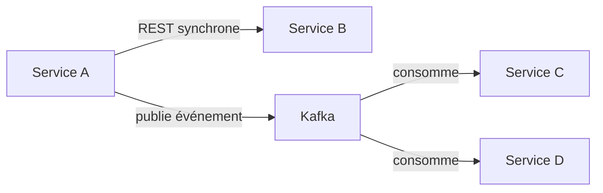

# Event-Driven vs Request-Response

> Deux modes de communication inter-services complémentaires, pas un choix binaire pour toute
> l'architecture — la question se pose service par service, interaction par interaction.

## 🎯 Pourquoi
Le request-response (REST/OpenFeign) donne une réponse immédiate et un couplage temporel simple à
raisonner ; l'event-driven (Kafka) découple les services dans le temps et permet à plusieurs
consommateurs de réagir au même événement sans que l'émetteur les connaisse.

## ✅ Quand l'utiliser (event-driven)
- Plusieurs services doivent réagir à un même fait métier (ex. `NoteCreatedEvent` déclenche à la
  fois une notification et une mise à jour de statistiques) sans que le service émetteur ait à
  connaître chacun de ses consommateurs.
- Le consommateur peut tolérer un traitement asynchrone (pas besoin d'une réponse immédiate à
  l'appelant).

## ⛔ Quand NE PAS l'utiliser
- L'appelant a besoin d'une réponse immédiate pour continuer son propre traitement (ex. valider une
  disponibilité avant de confirmer une réservation) — le request-response reste plus simple et plus
  lisible dans ce cas.
- Le flux est strictement séquentiel entre deux services sans besoin de plusieurs consommateurs —
  ajouter un bus d'événements ici n'apporte que de la complexité opérationnelle sans bénéfice réel.

## 🏗️ Diagramme

## 💡 Exemple concret
Dans `projects/notes-app-microservices` : la création d'une note passe par un appel REST direct
pour la validation immédiate (l'utilisateur doit voir sa note créée tout de suite), tandis que les
notifications et les statistiques dérivées passent par Kafka — deux modes coexistants dans la même
plateforme, choisis interaction par interaction.

## ⚖️ Trade-offs
| Gagné (event-driven) | Perdu (event-driven) |
|---|---|
| Découplage, plusieurs consommateurs indépendants | Cohérence immédiate plus difficile à raisonner (cohérence à terme) |
| Résilience (le consommateur en panne rattrape son retard) | Complexité de diagnostic accrue (cf. `engineering-failures/kafka-consumer-lag-non-detecte.md`) |

## ⚠️ Erreurs fréquentes
- Faire de l'event-driven partout par principe → complexité opérationnelle inutile sur des flux
  simplement séquentiels.
- Utiliser du request-response en cascade sur une chaîne longue de services → couplage temporel
  fragile, un service lent ralentit toute la chaîne.

## 🔗 Références
- [engineering-cookbook/kafka-producer-consumer-spring.md](../engineering-cookbook/kafka-producer-consumer-spring.md)
- [engineering-decisions/0003-pourquoi-jhipster.md](../engineering-decisions/0003-pourquoi-jhipster.md)
