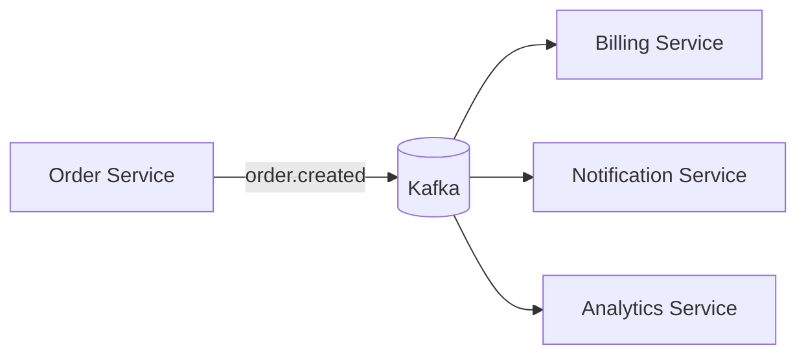

# Event-driven

> Les composants ne s'appellent pas directement — ils publient des faits passés (événements) et réagissent à ceux qui les intéressent, découplés dans le temps et dans l'espace.

## 🎯 Pourquoi

Dans une architecture request-response classique, le service A appelle directement le service B, attend sa réponse, et si B est lent ou down, A l'est aussi par ricochet. L'architecture événementielle inverse la relation : A publie "la commande 42 a été créée" sur un broker (Kafka, RabbitMQ) sans savoir qui écoute, ni combien de consommateurs il y a, ni s'ils traitent l'événement maintenant ou dans cinq minutes. Le découplage n'est pas qu'organisationnel — c'est un découplage temporel réel : le producteur n'attend jamais le consommateur. Voir [event-driven-vs-request-response.md](event-driven-vs-request-response.md) pour la comparaison détaillée des deux modèles.

## ✅ Quand l'utiliser

- Plusieurs consommateurs indépendants doivent réagir au même fait métier sans que le producteur ait besoin de les connaître (facturation, notification, analytics qui réagissent tous à "commande créée").
- Le traitement peut être asynchrone sans dégrader l'expérience utilisateur — l'utilisateur n'a pas besoin d'attendre que la facture soit générée pour voir sa commande confirmée.
- Le système doit absorber des pics de charge sans propager la pression en cascade — un broker fait tampon, un appel HTTP synchrone ne le fait pas.

## ⛔ Quand NE PAS l'utiliser

- L'appelant a besoin immédiatement du résultat pour continuer son propre traitement (ex: valider un paiement avant de confirmer une commande) — l'asynchrone introduit une complexité de coordination (voir [saga-pattern.md](saga-pattern.md)) qui n'a de sens que si l'attente synchrone est vraiment évitable.
- L'équipe n'a pas l'infrastructure (broker géré, monitoring de lag, DLQ) pour opérer un système événementiel correctement — un Kafka mal monitoré casse silencieusement, contrairement à un appel HTTP qui échoue bruyamment.
- Le debug end-to-end doit rester simple : tracer un flux à travers cinq consommateurs asynchrones est structurellement plus dur qu'une pile d'appels synchrones, même avec du tracing distribué en place.

## 🏗️ Diagramme

## 💡 Exemple concret

`network-monitor-dashboard` (`projects/standard-projects/`) illustre le principe même sans broker externe : les événements de scan réseau sont produits en continu et les composants d'affichage/alerte consomment à leur propre rythme, découplés du cycle de scan. À l'échelle microservices, le même principe s'implémenterait avec Kafka entre un service de scan et des consommateurs de dashboard/alerting indépendants.

## ⚖️ Trade-offs

| Gagné | Perdu |
|---|---|
| Découplage réel producteur/consommateur, résilience aux pics | Cohérence immédiate — le consommateur voit l'événement après coup, jamais avant |
| Ajouter un nouveau consommateur ne touche pas le producteur | Debug et traçabilité end-to-end plus complexes |
| Absorbe la charge via le broker au lieu de la propager | Infrastructure supplémentaire à opérer et monitorer (lag, DLQ, rétention) |

## ⚠️ Erreurs fréquentes

- Traiter le broker comme une file de tâches classique sans gérer l'idempotence côté consommateur → un même événement peut être livré plusieurs fois (at-least-once delivery), un consommateur non idempotent double-traite silencieusement.
- Oublier le monitoring du consumer lag → un consommateur qui ralentit ou plante ne se voit pas immédiatement dans les logs applicatifs, seulement dans une métrique de lag qu'il faut activement surveiller.
- Faire porter à l'événement une sémantique de commande ("facture cette commande") plutôt qu'un fait passé ("commande créée") → un événement décrit ce qui s'est produit, pas ce que le consommateur doit faire ; mélanger les deux recouple producteur et consommateur par la sémantique du message.

## 🔗 Références

- [event-driven-vs-request-response.md](event-driven-vs-request-response.md) — comparaison directe des deux modèles
- [event-sourcing.md](event-sourcing.md) — quand l'événement devient la source de vérité, pas juste une notification
- [saga-pattern.md](saga-pattern.md) — coordonner une transaction métier qui traverse plusieurs consommateurs asynchrones
