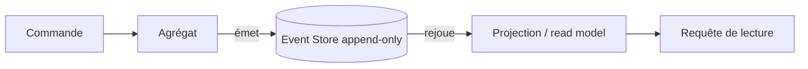

# Event sourcing

> L'état n'est jamais stocké directement — il se reconstruit en rejouant la séquence complète des événements qui l'ont produit.

## 🎯 Pourquoi

Un modèle classique (CRUD) stocke l'état courant et écrase l'ancien à chaque update — le fait qu'un compte soit passé par cinq statuts avant d'arriver à "actif" est perdu, seul "actif" reste. L'event sourcing stocke à la place chaque changement comme un événement immuable append-only (`CompteCree`, `CompteApprouve`, `CompteActive`), et l'état courant devient une projection calculée en rejouant ces événements dans l'ordre. Ça répond à un besoin précis : quand le "pourquoi on en est arrivé là" compte autant que le "où on en est", et qu'un audit trail ne peut pas être une fonctionnalité ajoutée après coup (elle est structurellement garantie par le modèle de stockage lui-même).

## ✅ Quand l'utiliser

- Domaine avec une exigence réelle d'audit trail complet — finance, santé, tout ce qui touche à la conformité réglementaire où "on ne peut pas prouver ce qui s'est passé" est un problème légal, pas juste technique.
- Besoin de reconstruire l'état à un instant T passé (debug d'un incident, litige client "mon solde n'était pas censé être ça le 15 du mois") sans avoir prévu explicitement une table d'historique pour chaque champ.
- Couplé à [CQRS](cqrs.md) : les événements servent de source de vérité côté écriture, et alimentent une ou plusieurs projections de lecture optimisées pour chaque cas d'usage.

## ⛔ Quand NE PAS l'utiliser

- Domaine CRUD classique sans besoin réel d'historique — reconstruire l'état à chaque lecture en rejouant des événements pour un cas qui n'en a pas besoin est un coût de complexité pur, sans bénéfice en face.
- Équipe qui n'a jamais géré la question des **event schema migrations** — un événement stocké il y a deux ans avec un schéma qui a changé depuis doit toujours pouvoir être rejoué correctement ; c'est le piège numéro un du pattern, largement sous-estimé avant de le rencontrer en vrai.
- Besoin de requêtes ad hoc complexes sur l'état courant sans vouloir maintenir de projection dédiée — sans projection à jour, chaque requête un peu élaborée implique de rejouer potentiellement des millions d'événements.

## 🏗️ Diagramme

## 💡 Exemple concret

Un cas typique côté BSS/billing : reconstituer l'état d'un compte prépayé à un instant précis pour répondre à une contestation client ("pourquoi mon solde a été débité de ce montant le 15") est exactement le problème que l'event sourcing résout nativement — chaque `Recharge`, `Consommation`, `Ajustement` reste un événement individuel horodaté, rejouable, au lieu d'un solde final sans trace du chemin parcouru. C'est d'ailleurs proche de ce qu'un [CDR (Call Detail Record)](../telecom/billing/mediation.md) fait déjà nativement dans le monde telecom — la mediation billing pratique une forme d'event sourcing depuis des décennies, avant que le terme n'existe côté logiciel applicatif.

## ⚖️ Trade-offs

| Gagné | Perdu |
|---|---|
| Audit trail complet et natif, pas une fonctionnalité ajoutée après coup | Complexité de lecture : l'état courant n'est jamais stocké tel quel |
| Debug d'incident facilité (rejouer jusqu'à l'état exact d'un instant T) | Migration de schéma d'événement = piège classique, à anticiper dès le départ |
| Se combine naturellement avec CQRS pour des read models multiples | Volume de stockage qui croît indéfiniment (nécessite une stratégie de snapshot/archivage) |

## ⚠️ Erreurs fréquentes

- Stocker un événement qui capture l'intention ("le client a demandé un changement d'adresse") plutôt que le fait déjà survenu ("l'adresse a été changée") — l'event sourcing modélise des faits immuables du passé, pas des commandes en attente.
- Oublier la stratégie de snapshot : sans un snapshot périodique de l'état, rejouer des millions d'événements à chaque lecture devient un problème de performance qui n'apparaît qu'en production, sur les agrégats les plus anciens et les plus actifs.
- Changer la structure d'un type d'événement existant sans plan de migration — les anciens événements stockés avec l'ancien schéma doivent toujours être rejouables ; c'est un problème de compatibilité ascendante permanent, pas un détail secondaire.

## 🔗 Références

- Martin Fowler, "Event Sourcing" (bliki)
- Greg Young, travaux fondateurs sur CQRS/Event Sourcing
- [cqrs.md](cqrs.md) — le pattern avec lequel event sourcing se combine le plus naturellement
- [telecom/billing/mediation.md](../telecom/billing/mediation.md) — un cas réel d'event sourcing "avant l'heure" côté telecom
