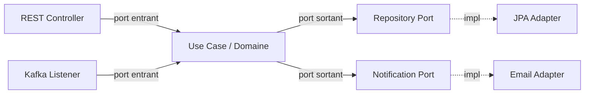

# Hexagonal (ports & adapters)

> Le domaine ne connaît ni la base de données, ni le framework web, ni Kafka — il ne connaît que ses propres interfaces.

## 🎯 Pourquoi

Dans un service Spring classique, le code métier finit collé aux annotations JPA, aux `@RestController`, parfois même à un `KafkaTemplate` injecté directement dans un service "métier". Ça marche, jusqu'au jour où il faut remplacer Kafka par autre chose, ou tester la logique sans démarrer tout Spring. Hexagonal répond à ça : le domaine définit des **ports** (interfaces), et tout ce qui est technique — HTTP, base, messaging — devient un **adapter** qui implémente ou consomme ces ports. Le domaine ne dépend de rien ; c'est l'infrastructure qui dépend du domaine.

## ✅ Quand l'utiliser

- Logique métier non triviale, avec des règles qui vont survivre au choix technique du moment (base, broker, framework).
- Besoin de tester le cœur métier sans conteneur Spring, sans base réelle, sans mock de framework.
- Un service voué à durer, avec plusieurs adapters d'entrée probables (REST aujourd'hui, événements Kafka demain).

## ⛔ Quand NE PAS l'utiliser

- Un CRUD sans règle métier réelle — le port/adapter devient une couche d'indirection qui ne protège rien, juste du code en plus à maintenir. Un `@RestController` → `@Service` → `Repository` classique fait le travail sans cérémonie.
- Petit service jetable, script d'admin, prototype. L'investissement en abstraction ne se rentabilise pas.
- Équipe qui découvre le pattern sous pression de deadline — mieux vaut l'introduire sur un module calme d'abord.

## 🏗️ Diagramme

## 💡 Exemple concret

Sur `helpdesk-ticket-system` (`projects/macro-projects/`), le service applique déjà une séparation service/repository classique mais pas hexagonale au sens strict — c'est volontaire, le projet n'a pas la complexité qui justifierait le port/adapter complet. Un bon candidat pour une vraie migration hexagonale serait plutôt un module de facturation avec plusieurs canaux d'entrée (API + événements) et plusieurs systèmes aval (base + notification + audit externe) — le genre de cas qu'on croise en environnement billing/mediation, pas dans un ticketing simple.

## ⚖️ Trade-offs

| Gagné | Perdu |
|---|---|
| Domaine testable en isolation, sans Spring ni base | Plus de fichiers, plus d'interfaces pour un même comportement |
| Changement d'infra (DB, broker) sans toucher au métier | Courbe d'apprentissage pour l'équipe pas familière du pattern |
| Frontière claire entre "règle métier" et "détail technique" | Sur-ingénierie fréquente si appliqué à un module simple |

## ⚠️ Erreurs fréquentes

- Créer un port pour chaque méthode CRUD sans jamais avoir plus d'un adapter derrière — à ce moment-là l'interface n'apporte rien, c'est de l'indirection gratuite.
- Laisser fuiter une annotation JPA (`@Entity`, `@Column`) dans un objet du domaine "juste pour aller plus vite" — ça recolle immédiatement le domaine à l'infra, tout l'intérêt du pattern disparaît.
- Confondre "port" et "DTO" : le port est un contrat de comportement, pas juste un objet de transfert.

## 🔗 Références

- Alistair Cockburn, article original sur l'architecture hexagonale (2005)
- [security-patterns/oauth2-keycloak.md](../security-patterns/oauth2-keycloak.md) — bon exemple d'adapter (le Resource Server est un adapter d'entrée autour du domaine)
