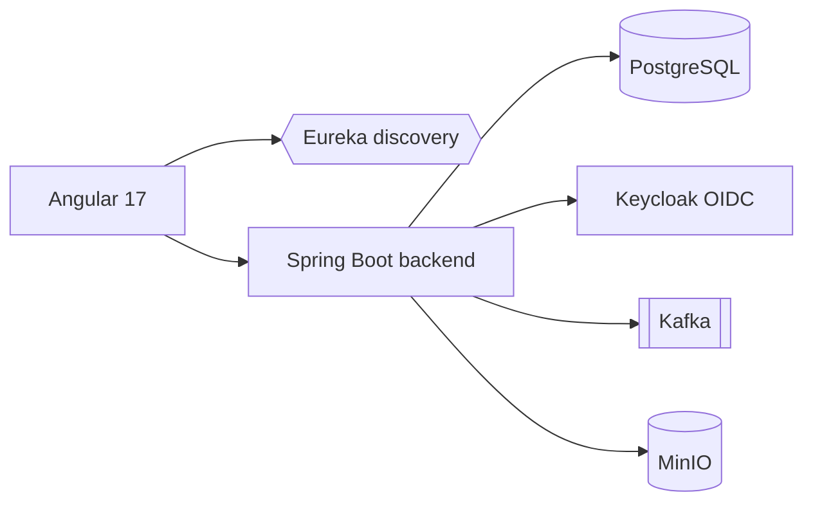

# Microservices

> Découper une application en services indépendants, déployables séparément, communiquant par le réseau.

## 🎯 Pourquoi
Permettre à plusieurs équipes de livrer indépendamment, de scaler chaque capacité séparément et
d'isoler les pannes. On échange la simplicité d'un monolithe contre l'autonomie et la résilience.

## ✅ Quand l'utiliser
- Plusieurs équipes qui se marchent dessus dans un même monolithe.
- Des besoins de scaling très différents selon les modules (ex. upload de fichiers vs. auth).
- Un domaine déjà bien compris, avec des frontières (bounded contexts) claires.

## ⛔ Quand NE PAS l'utiliser
- Démarrage / MVP : le coût opérationnel (réseau, observabilité, déploiement) écrase l'équipe.
- Domaine encore flou : on figera de mauvaises frontières, très coûteuses à bouger ensuite.
- Une seule petite équipe : un **modular-monolith** donne 80 % des bénéfices sans la douleur réseau.

## 🏗️ Diagramme — cas `projects/notes-app-microservices`

## 💡 Exemple concret
`projects/notes-app-microservices` : backend Spring Boot + discovery Eureka, auth déléguée à Keycloak
(OAuth2 resource server), événements via Kafka, fichiers via MinIO, front Angular. Chaque brique
tourne dans son conteneur (docker-compose).

## ⚖️ Trade-offs
| Gagné | Perdu |
|---|---|
| Déploiement & scaling indépendants | Complexité réseau (latence, pannes partielles) |
| Isolation des pannes | Cohérence forte → cohérence éventuelle |
| Autonomie des équipes | Observabilité et debugging distribués obligatoires |

## ⚠️ Erreurs fréquentes
- **Nano-services** : découper trop fin → chaque feature touche 5 services.
- **Base de données partagée** entre services → couplage caché, on n'a gagné qu'un monolithe distribué.
- Pas d'observabilité distribuée (tracing) dès le début → debugging impossible en prod.

## 🔗 Références
- [engineering-decisions](../engineering-decisions/) — les ADR qui justifient Keycloak, Kafka, Eureka.
- Sam Newman, *Building Microservices*.
