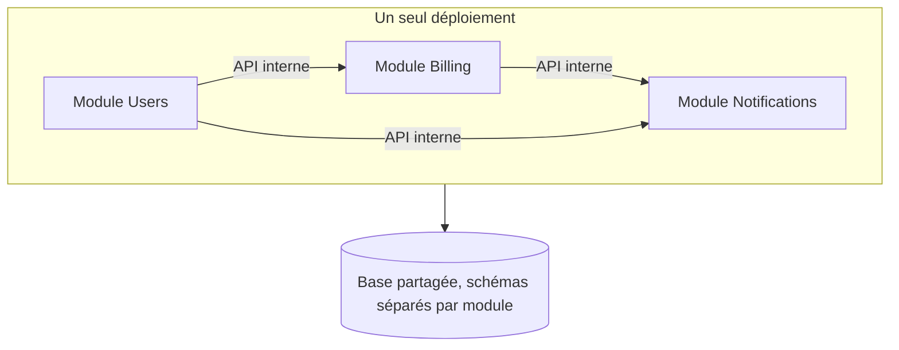

# Modular monolith

> Un seul déploiement, des frontières internes strictes — les avantages d'organisation des microservices sans en payer le coût opérationnel.

## 🎯 Pourquoi

L'argument pour les microservices est presque toujours "on veut des frontières claires entre les domaines métier" — mais ça n'implique pas forcément un déploiement séparé par domaine. Le monolithe modulaire répond au même besoin d'organisation (chaque module possède son propre code, ses propres tables, une API interne définie) sans les coûts qui viennent avec la distribution : latence réseau entre modules, complexité de déploiement multi-service, cohérence transactionnelle à gérer manuellement, observabilité distribuée. C'est souvent le point de départ le plus honnête pour une équipe qui n'a pas encore la charge (ni l'équipe ops) qui justifierait des microservices.

## ✅ Quand l'utiliser

- Équipe petite à moyenne (une dizaine de développeurs ou moins) qui n'a pas la bande passante ops pour opérer plusieurs services indépendamment.
- Domaines métier identifiables mais dont les frontières bougent encore — un monolithe modulaire se refactore en interne bien plus vite qu'un découpage en microservices qu'il faudrait défaire.
- Besoin de transactions ACID qui traversent plusieurs domaines métier régulièrement — un monolithe garde ça trivial, un microservice le transforme en saga distribuée (voir [saga-pattern.md](saga-pattern.md)) à chaque fois.
- Étape de transition explicite avant microservices : découper en modules internes d'abord, extraire en services séparés seulement les modules qui montrent un vrai besoin d'échelle ou de cycle de déploiement indépendant.

## ⛔ Quand NE PAS l'utiliser

- Des équipes différentes doivent pouvoir déployer indépendamment sans se coordonner — le monolithe modulaire reste un seul déploiement, donc un seul train de release pour tout le monde.
- Des besoins de scaling radicalement différents entre modules (un module qui a besoin de 50 instances, un autre d'une seule) — scaler un monolithe scale tout le processus, pas juste le module chargé.
- L'équipe ne respecte pas la discipline des frontières de module en pratique — un "monolithe modulaire" où les modules s'appellent directement via leurs classes internes au lieu de passer par l'API définie redevient un monolithe classique en quelques mois, avec tous les inconvénients et aucun des avantages.

## 🏗️ Diagramme

## 💡 Exemple concret

Sur `helpdesk-ticket-system` (`projects/macro-projects/`), le découpage `controller`/`service`/`repository` par package est un premier pas vers la modularité, mais pas encore un vrai monolithe modulaire au sens strict — il n'y a pas de frontière imposée empêchant un module d'appeler directement le repository interne d'un autre. Un vrai monolithe modulaire imposerait ça au niveau du build (modules Maven séparés avec des dépendances explicites, ou `package-info.java` + un outil comme ArchUnit pour faire échouer le build si une frontière est violée).

## ⚖️ Trade-offs

| Gagné | Perdu |
|---|---|
| Transactions ACID transverses aux modules, sans saga | Scaling uniforme : impossible de scaler un module seul |
| Déploiement unique, observabilité simple (un seul processus) | Un bug dans un module peut faire tomber tout le processus |
| Refactoring de frontières bien plus rapide qu'entre microservices | Toute l'équipe partage le même cycle de release |

## ⚠️ Erreurs fréquentes

- Appeler directement les classes internes d'un autre module "parce que c'est plus rapide à écrire" → la frontière de module devient purement documentaire, plus réelle. Sans outil qui fait échouer le build (ArchUnit, modules Maven/Gradle stricts), la discipline ne tient pas dans le temps.
- Partager une seule table entre deux modules "pour éviter la duplication" → recrée un couplage fort qui rend l'extraction future en microservice impossible sans migration de données douloureuse.
- Considérer le monolithe modulaire comme une fin en soi permanente sans jamais réévaluer si un module a effectivement besoin d'être extrait — l'intérêt du pattern est justement de rendre cette décision réversible et progressive, pas de l'éviter indéfiniment.

## 🔗 Références

- Simon Brown, "Modular Monoliths" (talks et articles de référence sur le sujet)
- [microservices.md](microservices.md) — le point d'arrivée si un module a effectivement besoin d'être extrait
- [saga-pattern.md](saga-pattern.md) — ce que devient une transaction transverse une fois les modules séparés en services
