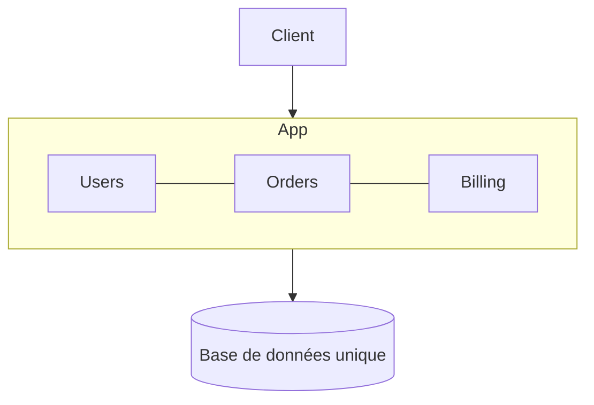

# Monolith

> Un seul déploiement, une seule base de code, pas de frontière imposée entre les domaines métier — le point de départ par défaut, pas un anti-pattern.

## 🎯 Pourquoi

Avant de parler microservices ou modulaire, il faut être honnête sur ce qu'est un monolithe classique : toute la logique métier vit dans un seul processus déployable, généralement avec une seule base de données partagée sans frontière stricte entre les schémas. Ce n'est pas un manque d'ambition architecturale, c'est la forme la plus simple qui existe — un seul repo à cloner, un seul artefact à déployer, une seule transaction pour tout ce qui touche plusieurs tables. La réputation négative du monolithe vient presque toujours d'un monolithe qui a grossi sans discipline interne (le "big ball of mud"), pas du modèle de déploiement en lui-même.

## ✅ Quand l'utiliser

- Début de projet, équipe petite, domaine métier encore flou — n'importe quelle frontière qu'on imposerait maintenant serait une supposition, pas une observation. Le monolithe garde tout modifiable sans coût de migration inter-service.
- Produit avec une charge modérée et prévisible, où la latence réseau entre composants n'apporterait aucune valeur — un appel de méthode Java est gratuit, un appel HTTP entre deux services ne l'est jamais.
- Équipe unique ou très réduite qui n'a pas besoin de déployer des parties du système indépendamment les unes des autres.

## ⛔ Quand NE PAS l'utiliser

- Le code a grossi au point que personne ne comprend plus l'ensemble des dépendances internes, et chaque changement risque de casser un module sans lien apparent — c'est le signal qu'il faut au minimum passer à un [monolithe modulaire](modular-monolith.md) avant d'envisager quoi que ce soit d'autre.
- Plusieurs équipes doivent livrer indépendamment sans se bloquer mutuellement sur le même train de release.
- Un sous-domaine a des besoins de scaling radicalement différents du reste (ex: un moteur de recherche qui doit scaler à 50 instances pendant que le reste du système tourne bien avec 3).

## 🏗️ Diagramme

## 💡 Exemple concret

`issue-tracker-mini` et `personal-finance-dashboard` (`projects/standard-projects/`) sont de vrais monolithes Spring Boot au sens strict : un seul artefact déployable, une base H2/PostgreSQL unique, pas de frontière de module imposée au niveau du build. C'est le bon choix pour leur taille — y introduire des microservices n'apporterait que de la complexité opérationnelle sans bénéfice réel.

## ⚖️ Trade-offs

| Gagné | Perdu |
|---|---|
| Simplicité de déploiement, debug, transaction | Impossible de scaler un sous-domaine indépendamment |
| Refactoring rapide (tout est dans le même IDE, le même build) | Le couplage implicite s'installe vite sans discipline |
| Zéro coût réseau entre composants internes | Un seul train de release pour toute l'équipe |

## ⚠️ Erreurs fréquentes

- Traiter "monolithe" et "code mal organisé" comme synonymes → un monolithe avec des packages bien séparés et des frontières respectées (voir [modular-monolith.md](modular-monolith.md)) reste parfaitement viable à moyen terme, ce n'est pas la forme de déploiement qui pose problème.
- Migrer vers les microservices "parce que c'est ce que font les grandes entreprises" sans avoir identifié un vrai besoin de scaling ou d'autonomie d'équipe → voir [microservices.md](microservices.md) pour les conditions qui justifient réellement ce coût.
- Laisser la base de données devenir le point de couplage caché : deux modules qui se lisent mutuellement les tables sans passer par une API interne recréent un couplage fort invisible dans le code.

## 🔗 Références

- [modular-monolith.md](modular-monolith.md) — l'étape suivante naturelle avant d'envisager une distribution
- [microservices.md](microservices.md) — le point d'arrivée seulement si le besoin de scaling/autonomie est réel et mesuré
