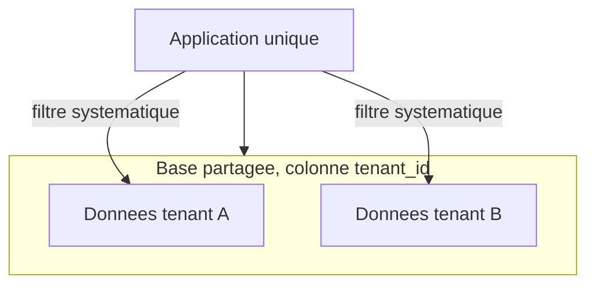

# Multi-tenant

> Une seule application sert plusieurs clients isolés (tenants) — la question centrale n'est pas "comment coder ça" mais "à quel niveau isoler les données", et cette décision est difficile à changer une fois prise.

## 🎯 Pourquoi

Un SaaS B2B sert typiquement des dizaines, centaines ou milliers d'organisations clientes depuis
la même infrastructure — opérer une instance séparée par client ne passe pas à l'échelle
opérationnellement (mises à jour, monitoring, coût). Le multi-tenant répond à ça, mais la vraie
question n'est jamais "multi-tenant oui ou non", c'est "à quel niveau d'isolation" — et c'est un
choix architectural qui a des conséquences directes sur la sécurité (une fuite de données entre
tenants est le pire scénario possible pour ce genre d'application) et sur les coûts d'exploitation.

## ✅ Quand l'utiliser

- SaaS B2B avec un nombre de clients suffisant pour que le coût d'une instance par client soit
  prohibitif, et des besoins fonctionnels largement partagés entre tenants (le cœur du produit
  est le même pour tous, seules les données diffèrent).
- Besoin de déployer une évolution une seule fois pour tous les clients, plutôt que de gérer N
  déploiements indépendants avec potentiellement N versions différentes en parallèle.

## ⛔ Quand NE PAS l'utiliser

- Exigence de conformité réglementaire qui impose une isolation physique totale des données d'un
  client (secteur bancaire ou santé dans certaines juridictions) — dans ce cas, une base par
  tenant (au minimum) n'est pas une option architecturale parmi d'autres, c'est une contrainte.
- Un seul très gros client avec des besoins radicalement différents des autres — le forcer dans le
  même modèle de données que le reste complique tout sans bénéfice réel, une instance dédiée est
  souvent plus simple à ce stade.
- Équipe qui n'a pas encore internalisé la discipline "chaque requête doit filtrer par tenant" —
  sans ça, le premier oubli devient une fuite de données entre clients, pas un bug cosmétique.

## 🏗️ Diagramme



## Les trois niveaux d'isolation, et leur vrai compromis

- **Base par tenant** : isolation maximale, chaque client a sa propre base physique. Coût
  opérationnel le plus élevé (migrations à rejouer N fois, monitoring par instance), mais élimine
  structurellement le risque de fuite de données entre tenants — un bug applicatif ne peut
  physiquement pas faire fuiter les données d'un autre tenant puisqu'elles ne sont pas accessibles
  depuis la même connexion.
- **Schéma par tenant** (une base, un schéma PostgreSQL par client) : isolation intermédiaire,
  migrations à rejouer par schéma mais sur la même instance base — compromis raisonnable pour un
  nombre de tenants modéré (dizaines à basse centaines).
- **Colonne `tenant_id`** (une base, un schéma, une colonne de discrimination sur chaque table) :
  le moins coûteux à opérer, scale le mieux en nombre de tenants (milliers), mais **toute la
  sécurité repose sur le fait qu'aucune requête n'oublie jamais le filtre `tenant_id`** — un seul
  endpoint qui l'oublie devient une fuite de données inter-clients.

## 💡 Exemple concret

Le modèle colonne `tenant_id` se sécurise en pratique en le rendant impossible à oublier plutôt
qu'en comptant sur la discipline de chaque développeur à chaque requête :
```java
// Filtre applique automatiquement a TOUTE requete Hibernate sur les entites @TenantAware,
// sans que chaque repository ait a s'en souvenir explicitement
@FilterDef(name = "tenantFilter", parameters = @ParamDef(name = "tenantId", type = Long.class))
@Filter(name = "tenantFilter", condition = "tenant_id = :tenantId")
@Entity
public class Booking { /* ... */ }
```
```java
// Active au debut de chaque requete, a partir du tenant resolu depuis le JWT/sous-domaine
session.enableFilter("tenantFilter").setParameter("tenantId", currentTenantId());
```
Ce genre de mécanisme (filtre Hibernate, Row-Level Security PostgreSQL) déplace la garantie
d'isolation du niveau "chaque développeur s'en souvient" au niveau "le framework/la base
l'applique systématiquement" — c'est la différence entre une bonne pratique et une garantie
réelle.

## ⚖️ Trade-offs

| Gagné | Perdu |
|---|---|
| Un seul déploiement, une seule version pour tous les tenants | Toute fuite d'isolation devient un incident de sécurité inter-clients |
| Coût d'infrastructure mutualisé, scale bien en nombre de tenants (colonne) | Scaling différencié par tenant difficile (un "gros" tenant impacte tous les autres sur la même base) |
| Migrations et évolutions déployées une seule fois | Choix d'isolation difficile à changer après coup (migration de données lourde) |

## ⚠️ Erreurs fréquentes

- Choisir le modèle colonne `tenant_id` sans mécanisme d'application automatique (filtre ORM,
  Row-Level Security base) — compter uniquement sur la discipline humaine à chaque requête sur
  des dizaines d'endpoints est structurellement fragile, ce n'est qu'une question de temps avant
  l'oubli.
- Mélanger les niveaux d'isolation sans raison claire (certaines tables en `tenant_id`, d'autres
  physiquement séparées) sans documenter pourquoi — rend le système difficile à raisonner et à
  auditer pour la sécurité.
- Sous-estimer le coût de migration d'un modèle d'isolation à un autre — décider ça tôt, avec les
  contraintes réglementaires du secteur en tête, plutôt que de le traiter comme un détail
  d'implémentation réversible.

## 🔗 Références

- [security-patterns/oauth2-keycloak.md](../security-patterns/oauth2-keycloak.md) — Keycloak
  gère nativement le multi-tenant via les realms, un modèle proche du "schéma par tenant" côté
  identité
- PostgreSQL Row-Level Security (RLS) — mécanisme natif pour appliquer l'isolation `tenant_id` au
  niveau base plutôt qu'au niveau applicatif uniquement
