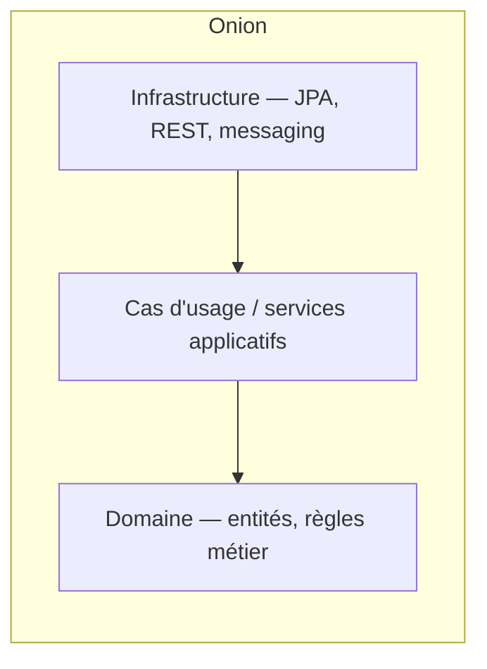

# Onion Architecture

> Le domaine métier au centre, tout le reste (base de données, framework web, UI) en couches concentriques qui dépendent vers l'intérieur — jamais l'inverse.

## 🎯 Pourquoi

L'idée centrale de l'onion (Jeffrey Palermo, 2008) : le code qui exprime les règles métier ne doit dépendre de rien de technique — pas de JPA, pas de Spring, pas de framework HTTP. Les couches externes (persistance, API REST, UI) dépendent du domaine, jamais l'inverse. Concrètement, ça veut dire que `Order` (l'entité métier) ne doit pas savoir que PostgreSQL existe, et la règle "une commande ne peut pas être annulée après expédition" doit pouvoir se tester sans base de données, sans serveur web, sans rien démarrer. C'est le même principe que [hexagonal.md](hexagonal.md), formulé différemment — l'onion insiste sur des couches concentriques explicites là où l'hexagonal parle de ports et d'adaptateurs.

## ✅ Quand l'utiliser

- La logique métier est riche et va évoluer indépendamment des choix techniques (changer de base de données, exposer une nouvelle API) — isoler le domaine évite que ces changements techniques forcent une réécriture des règles métier.
- Le projet doit rester testable unitairement sans infrastructure — tester "une commande ne peut pas être annulée après expédition" sans démarrer Spring ni une base de données change radicalement la vitesse des tests.
- Plusieurs interfaces doivent exposer le même domaine (API REST + job batch + interface CLI) sans dupliquer les règles métier dans chacune.

## ⛔ Quand NE PAS l'utiliser

- Le projet est un CRUD simple sans vraie logique métier à protéger — imposer des couches concentriques autour d'un `save()`/`findById()` ajoute de l'indirection sans bénéfice réel.
- L'équipe n'a pas la discipline de faire respecter la règle de dépendance (les couches externes ne dépendent que vers l'intérieur) — sans un outil comme ArchUnit pour la faire respecter au niveau du build, la structure en couches devient un idéal théorique vite contredit par le code réel.

## 🏗️ Diagramme

## 💡 Exemple concret

`helpdesk-ticket-system` (`projects/macro-projects/`) sépare `controller`/`service`/`repository`, ce qui va dans le sens de l'onion sans l'implémenter au sens strict : le `service` contient encore des annotations Spring (`@Transactional`) et le domaine (`Ticket`, `Project`) est une entité JPA directement annotée — dans un onion strict, l'entité de domaine serait un objet Java pur, et le mapping JPA vivrait dans une couche de persistance séparée qui la convertit.

## ⚖️ Trade-offs

| Gagné | Perdu |
|---|---|
| Domaine testable sans infrastructure, logique protégée des choix techniques | Plus de classes, plus de mapping entre couches (entité domaine ↔ entité JPA) |
| Changer de framework/DB touche les couches externes, pas le domaine | Courbe d'apprentissage et discipline d'équipe nécessaires pour que ça tienne |

## ⚠️ Erreurs fréquentes

- Annoter directement l'entité de domaine avec `@Entity`/`@Table` → le domaine dépend alors de JPA, exactement ce que l'onion cherche à éviter ; la couche persistance devrait posséder sa propre représentation et mapper vers/depuis le domaine.
- Mettre de la logique métier dans un `@Service` qui orchestre aussi des appels JPA directs → le service applicatif devient un fourre-tout où la règle métier et l'infrastructure se mélangent, perdant l'intérêt de la séparation.
- Confondre onion et hexagonal au point de les traiter comme deux choses différentes à appliquer en même temps → ce sont deux vocabulaires pour la même idée de fond, voir [hexagonal.md](hexagonal.md).

## 🔗 Références

- [hexagonal.md](hexagonal.md) — la même idée, formulée en ports/adaptateurs plutôt qu'en couches concentriques
- [ddd.md](ddd.md) — l'onion est la structure de code qui accueille naturellement un domaine modélisé en DDD
- [clean.md](clean.md) — variante proche popularisée par Robert C. Martin, mêmes principes de dépendance
