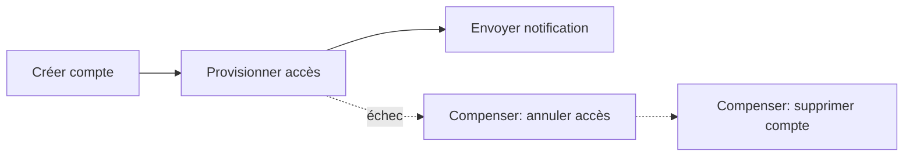

# Saga Pattern — transactions distribuées

> Gérer une opération métier qui s'étend sur plusieurs microservices sans transaction distribuée
> classique (2PC), en la décomposant en une séquence d'étapes locales compensables.

## 🎯 Pourquoi
Dans une architecture microservices, chaque service possède sa propre base de données —
impossible d'utiliser une transaction ACID unique à travers plusieurs services. La Saga décompose
l'opération globale en transactions locales successives, chacune avec une action de compensation
en cas d'échec d'une étape ultérieure.

## ✅ Quand l'utiliser
- Un processus métier traverse plusieurs services (ex. création de compte utilisateur + provision
  des accès + notification) où chaque étape doit être annulée proprement si une étape suivante
  échoue.
- Le système tolère une cohérence à terme (eventual consistency) plutôt qu'une cohérence
  immédiate stricte.

## ⛔ Quand NE PAS l'utiliser
- L'opération reste entièrement dans un seul service/une seule base → une transaction locale
  classique suffit, pas besoin de Saga.
- Le métier exige une cohérence immédiate stricte et ne tolère aucune fenêtre d'incohérence
  temporaire (rare, mais existe pour certaines opérations financières critiques).

## 🏗️ Diagramme

## 💡 Exemple concret
Le cycle de vie utilisateur du projet TTN (création, activation, blocage, suppression logique,
restauration synchronisée avec l'IAM Keycloak) suit ce principe : chaque étape a une action
inverse définie (ex. la suppression logique a sa restauration), plutôt qu'une transaction unique
qui engloberait à la fois la base applicative et Keycloak.

## ⚖️ Trade-offs
| Gagné | Perdu |
|---|---|
| Pas de verrou distribué, chaque service reste autonome | Complexité de la logique de compensation à écrire et tester |
| Résilience (une étape en échec ne bloque pas tout le système) | Fenêtre de cohérence temporaire à assumer côté métier |

## ⚠️ Erreurs fréquentes
- Oublier de tester réellement les chemins de compensation (ils sont rarement exercés en usage
  normal, donc rarement testés — et cassent silencieusement).
- Compensation non idempotente : si l'étape de compensation elle-même est rejouée (retry), elle
  doit pouvoir s'exécuter plusieurs fois sans effet de bord supplémentaire.

## 🔗 Références
- [engineering-cookbook/kafka-producer-consumer-spring.md](../engineering-cookbook/kafka-producer-consumer-spring.md) — la Saga chorégraphiée s'appuie souvent sur des événements Kafka entre étapes.
- [architecture-library/event-driven-vs-request-response.md](event-driven-vs-request-response.md)
