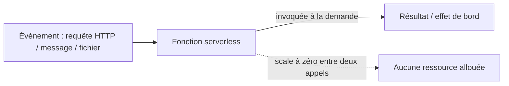

# Serverless

> Pas de serveur à provisionner ni à faire tourner en continu — le code s'exécute à la demande, facturé à l'exécution, et scale (ou disparaît) tout seul.

## 🎯 Pourquoi

"Serverless" ne veut pas dire qu'il n'y a pas de serveur — ça veut dire que sa gestion (provisioning, scaling, patch OS, capacité de réserve) n'est plus le problème de l'équipe applicative. Le modèle le plus courant, les Functions-as-a-Service (AWS Lambda, Azure Functions, Google Cloud Functions), exécute une fonction en réponse à un événement (requête HTTP, message de queue, fichier déposé), la facture à la milliseconde d'exécution réelle, et la fait disparaître entre deux invocations. Le compromis fondamental : on échange le contrôle sur l'infrastructure contre l'absence de coût quand rien ne se passe.

## ✅ Quand l'utiliser

- Charge très irrégulière ou imprévisible (webhook, traitement déclenché par événement rare) où maintenir un serveur allumé en permanence gaspillerait des ressources la majorité du temps.
- Tâches courtes et indépendantes : traitement d'image à l'upload, transformation de données entre deux systèmes, endpoint API à faible trafic.
- Équipe qui veut minimiser l'opérationnel d'infrastructure (pas de patch OS, pas de dimensionnement de cluster) au prix d'un contrôle plus fin sur l'environnement d'exécution.

## ⛔ Quand NE PAS l'utiliser

- Trafic soutenu et prévisible à volume élevé — au-delà d'un certain seuil, le coût par invocation d'une fonction serverless dépasse largement celui d'un serveur dimensionné correctement et tournant en continu.
- Latence de démarrage (cold start) incompatible avec le besoin — une fonction inactive depuis un moment doit se réinitialiser à la prochaine invocation, ce qui ajoute plusieurs centaines de millisecondes voire plus selon le runtime, inacceptable pour un chemin critique à faible latence.
- Traitement avec état ou connexions longues (WebSocket, streaming, transaction longue) — le modèle FaaS est pensé pour de l'exécution courte et sans état entre deux appels.
- Besoin de contrôle fin sur l'environnement (version exacte d'OS, bibliothèques natives précises, réglages réseau) que la plateforme serverless ne permet pas ou limite fortement.

## 🏗️ Diagramme

## 💡 Exemple concret

Aucun projet de `projects/` n'utilise le serverless aujourd'hui — c'est volontaire, tous sont des services Spring Boot pensés pour tourner en continu, cohérent avec le profil des projets (démonstration d'architecture microservices/monolithique classique, pas de cas d'usage à charge irrégulière qui justifierait du FaaS). Le candidat le plus réaliste serait une fonction de traitement de webhook (ex: notification de paiement) déclenchée rarement, plutôt qu'un service métier central.

## ⚖️ Trade-offs

| Gagné | Perdu |
|---|---|
| Zéro coût si aucune invocation, scaling automatique sans intervention | Cold start, latence variable selon l'inactivité récente |
| Aucun serveur à patcher, dimensionner, surveiller en continu | Coût par invocation qui dépasse un serveur dédié au-delà d'un certain volume |
| Bien adapté à l'événementiel irrégulier | Debug et test local plus contraignants, vendor lock-in souvent fort |

## ⚠️ Erreurs fréquentes

- Migrer un service à fort trafic constant vers du serverless "pour économiser" sans avoir fait le calcul de coût réel au volume observé — au-delà d'un certain seuil, c'est l'inverse qui se produit.
- Ignorer le cold start dans un chemin utilisateur sensible à la latence, découvrant le problème seulement en production sous trafic réel après une période d'inactivité.
- Traiter le serverless comme une architecture à part entière plutôt qu'un modèle de déploiement — une fonction FaaS peut très bien porter un design pourri (couplage fort, pas de séparation métier/infra) exactement comme un monolithe.

## 🔗 Références

- [event-driven.md](event-driven.md) — le serverless FaaS est presque toujours consommé en mode événementiel
- [microservices.md](microservices.md) — comparaison utile : le FaaS pousse le découpage en services encore plus loin, jusqu'à la fonction individuelle
