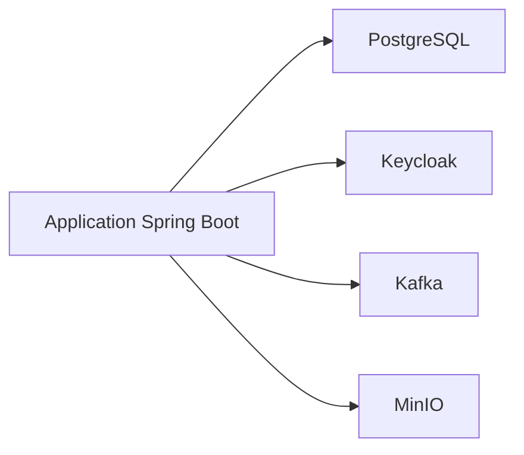

# Je veux monter un environnement multi-services avec Docker Compose

## 🎯 Le problème à résoudre
Faire tourner localement un ensemble cohérent de services d'infrastructure (base de données, IAM,
broker de messages, stockage objet) nécessaires à une plateforme microservices, sans les installer
un par un manuellement sur la machine de développement.

## 🧠 Les concepts nécessaires
- Réseau Docker partagé : les services se résolvent entre eux par nom de service, pas par IP.
- Healthcheck de service : un service dépendant attend que sa dépendance soit réellement prête, pas
  juste démarrée.
- Volumes nommés : persister les données (base, stockage objet) entre redémarrages du conteneur.

## 🏗️ Architecture minimale


## 💻 Exemple de code
```yaml
services:
  postgres:
    image: postgres:16
    environment:
      POSTGRES_PASSWORD: ${DB_PASSWORD}
    healthcheck:
      test: ["CMD-SHELL", "pg_isready -U postgres"]
      interval: 5s
      retries: 10
    volumes:
      - postgres-data:/var/lib/postgresql/data

  keycloak:
    image: quay.io/keycloak/keycloak:25.0
    command: start-dev
    depends_on:
      postgres:
        condition: service_healthy
    environment:
      KC_DB: postgres
      KC_DB_URL: jdbc:postgresql://postgres:5432/keycloak

volumes:
  postgres-data:
```

## ⚠️ Pièges à éviter
- `depends_on` sans condition de healthcheck ne garantit que l'ordre de démarrage du conteneur, pas
  que le service à l'intérieur soit réellement prêt (ex. Postgres démarré mais pas encore prêt à
  accepter des connexions) — toujours combiner avec `condition: service_healthy`.
- Mots de passe en dur dans le fichier `docker-compose.yml` versionné → toujours passer par des
  variables d'environnement (`.env` non versionné, cf.
  [code-review-guide/detecter-secrets-en-dur.md](../code-review-guide/detecter-secrets-en-dur.md)).

## 🚀 Variantes selon le contexte
- Environnement de développement local → `start-dev` pour Keycloak (rapide, non sécurisé pour la
  prod).
- Environnement de recette/staging → configuration Keycloak en mode production avec TLS.

## 🔗 Liens
- [engineering-decisions/0001-pourquoi-keycloak.md](../engineering-decisions/0001-pourquoi-keycloak.md)
- [engineering-checklists/avant-mise-en-prod.md](../engineering-checklists/avant-mise-en-prod.md)
