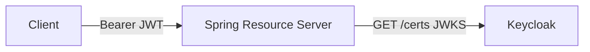

# Je veux valider un JWT dans Spring

## 🎯 Le problème à résoudre
Protéger les endpoints d'un backend Spring Boot avec des tokens JWT émis par Keycloak, sans gérer de
session ni de mot de passe côté service. S'applique à tout microservice de `projects/`.

## 🧠 Les concepts nécessaires
- **Resource Server** : le service valide les tokens, il ne les émet pas.
- **JWKS** : Keycloak expose ses clés publiques ; Spring récupère la clé pour vérifier la signature.
- **`issuer-uri`** : suffit à Spring pour découvrir JWKS et valider `iss`/expiration automatiquement.
- **Autorités** : les rôles Keycloak vivent dans `realm_access.roles`, à mapper en `GrantedAuthority`.

## 🏗️ Architecture minimale


## 💻 Exemple de code
```xml
<!-- pom.xml -->
<dependency>
  <groupId>org.springframework.boot</groupId>
  <artifactId>spring-boot-starter-oauth2-resource-server</artifactId>
</dependency>
```
```properties
spring.security.oauth2.resourceserver.jwt.issuer-uri=http://keycloak:8080/realms/notesapp
```
```java
@Bean
SecurityFilterChain security(HttpSecurity http) throws Exception {
  http.authorizeHttpRequests(a -> a
        .requestMatchers("/actuator/health").permitAll()
        .anyRequest().authenticated())
      .oauth2ResourceServer(o -> o.jwt(Customizer.withDefaults()));
  return http.build();
}
```

## ⚠️ Pièges à éviter
- **Rôles absents** : sans `JwtAuthenticationConverter`, `hasRole("X")` échoue toujours → mapper `realm_access.roles`.
- **`issuer-uri` localhost dans Docker** : utiliser le nom de service (`keycloak`), pas `localhost`.
- Oublier de laisser `/actuator/health` public → le healthcheck docker-compose tombe.

## 🚀 Variantes selon le contexte
- **Token opaque** (introspection) plutôt que JWT → `opaque-token.introspection-uri`.
- **Plusieurs issuers** (multi-tenant) → `AuthenticationManagerResolver` par realm.
- **Front Angular** : le token part en header `Authorization: Bearer` via un HttpInterceptor.

## 🔗 Liens
- [security-patterns/oauth2-keycloak.md](../security-patterns/oauth2-keycloak.md)
- [engineering-decisions/0001-pourquoi-keycloak.md](../engineering-decisions/0001-pourquoi-keycloak.md)
