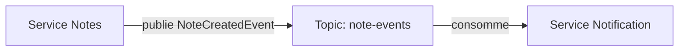

# Je veux publier et consommer des événements Kafka en Spring Boot

## 🎯 Le problème à résoudre
Faire communiquer deux microservices de façon découplée et asynchrone (ex. le service Notes publie
un événement quand une note est créée, le service Notification le consomme) sans appel HTTP direct
entre eux.

## 🧠 Les concepts nécessaires
- Topic : canal nommé sur lequel les événements sont publiés.
- Producer/Consumer : rôles d'émission et de réception.
- Groupe de consommateurs : plusieurs instances d'un même service se partagent les partitions d'un
  topic sans dupliquer le traitement.

## 🏗️ Architecture minimale


## 💻 Exemple de code
```java
// Producteur
@Service
class NoteEventPublisher {
    private final KafkaTemplate<String, NoteCreatedEvent> kafkaTemplate;

    void publish(NoteCreatedEvent event) {
        kafkaTemplate.send("note-events", event.noteId().toString(), event);
    }
}

// Consommateur
@Component
class NoteEventListener {
    @KafkaListener(topics = "note-events", groupId = "notification-service")
    void onNoteCreated(NoteCreatedEvent event) {
        notificationService.notifyOwner(event);
    }
}
```

## ⚠️ Pièges à éviter
- Pas de clé de partitionnement cohérente → événements liés à la même entité traités dans le
  désordre par des consommateurs différents. Utiliser l'identifiant métier (ici `noteId`) comme clé.
- Traitement non idempotent → un message rejoué (redémarrage, retry) traité deux fois cause un
  effet de bord dupliqué (ex. double notification). Rendre le traitement idempotent (vérifier un
  identifiant d'événement déjà traité).

## 🚀 Variantes selon le contexte
- Besoin d'ordonnancement strict multi-topics → envisager une seule partition ou un agrégat
  d'événements séquencés plutôt que plusieurs topics indépendants.
- Traitement critique qui ne doit jamais être perdu → activer les accusés de réception manuels
  (`ackMode: MANUAL`) plutôt que l'auto-commit par défaut.

## 🔗 Liens
- [engineering-failures/kafka-consumer-lag-non-detecte.md](../engineering-failures/kafka-consumer-lag-non-detecte.md)
- [architecture-library/event-driven-vs-request-response.md](../architecture-library/event-driven-vs-request-response.md)
