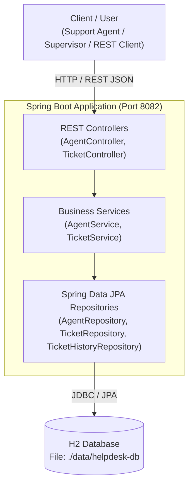
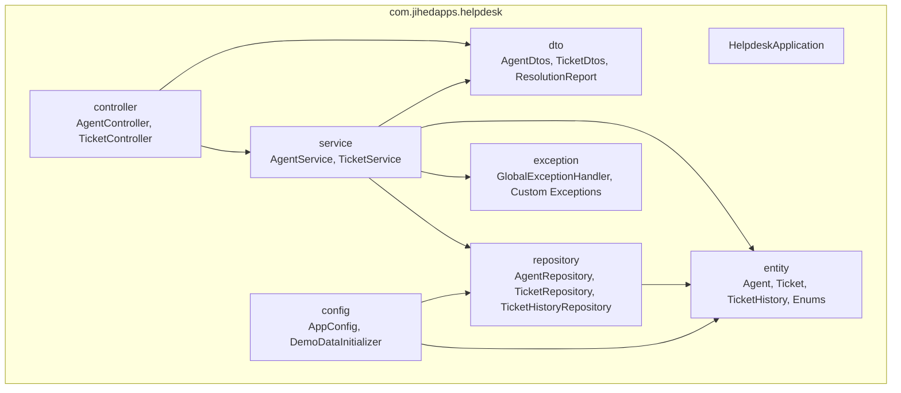
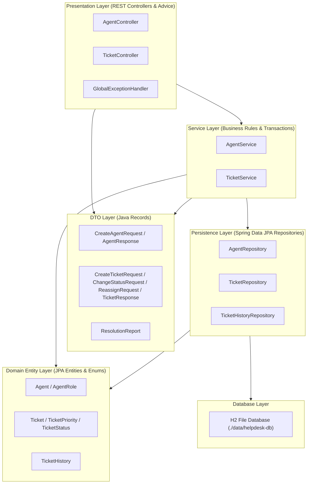
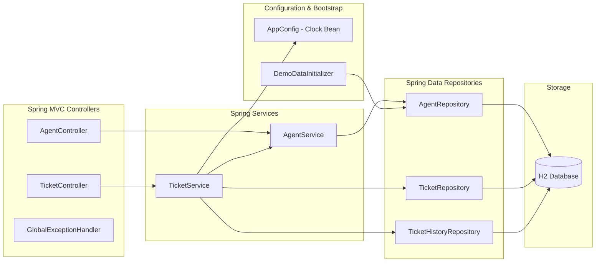
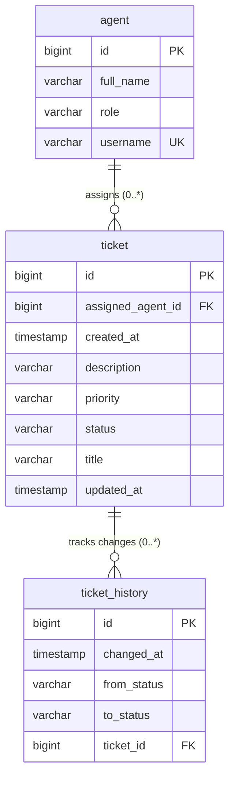
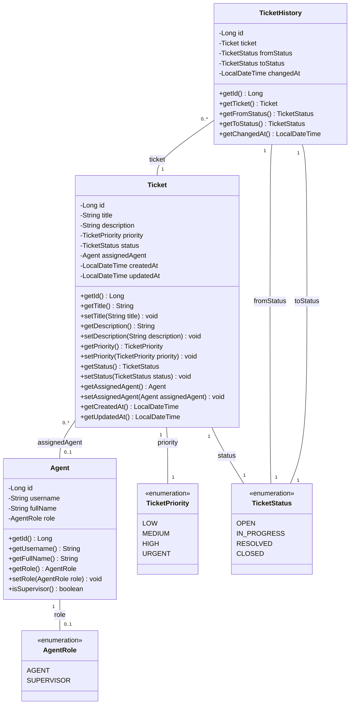
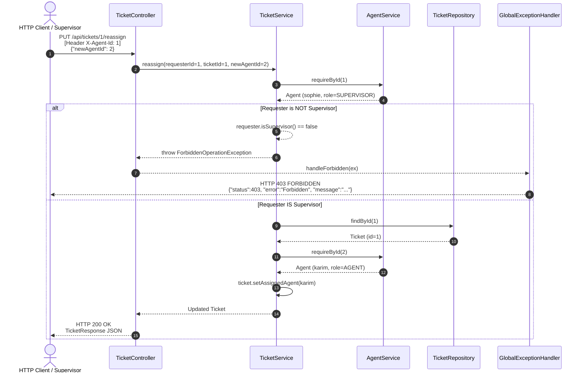
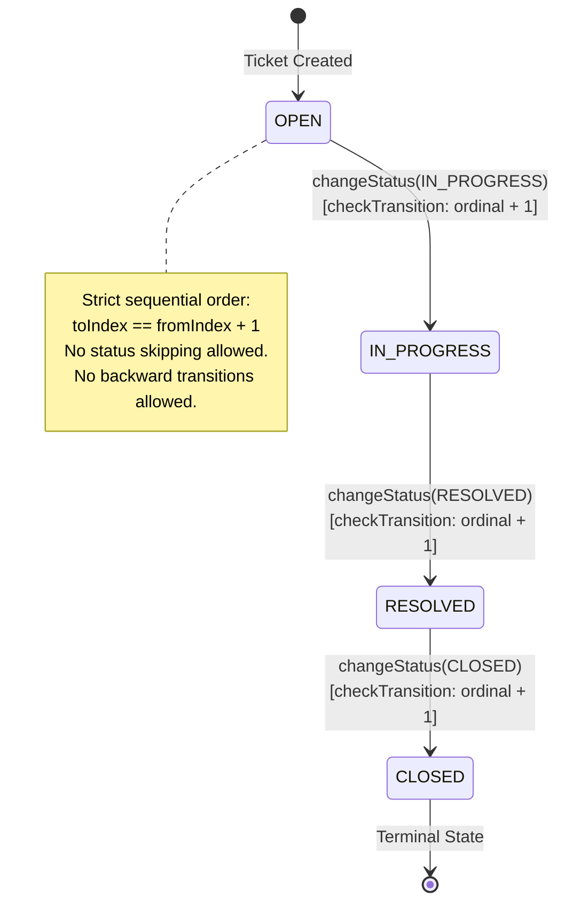

# Helpdesk Ticket System

API REST de gestion de tickets de support, avec un workflow de statuts strict et un
reporting du temps moyen de resolution par agent.

## But

Simuler un outil de support type Zendesk simplifie : des agents traitent des tickets qui
suivent un cycle de vie impose (pas de raccourci de statut), un superviseur peut
reassigner un ticket a un autre agent, et on peut mesurer la performance de resolution
par agent.

## Architecture

Monolithe Spring Boot en couches, module Maven unique :

| Couche | Package | Role |
|---|---|---|
| Controller | `com.jihedapps.helpdesk.controller` | Endpoints REST, mapping DTO <-> service, codes HTTP |
| Service | `com.jihedapps.helpdesk.service` | Regles metier (workflow, autorisation, reporting), transactions |
| Repository | `com.jihedapps.helpdesk.repository` | Acces donnees via Spring Data JPA |
| Entity | `com.jihedapps.helpdesk.entity` | Modele de domaine (Agent, Ticket, TicketHistory) |
| DTO | `com.jihedapps.helpdesk.dto` | Contrats d'entree/sortie de l'API (records) |
| Exception | `com.jihedapps.helpdesk.exception` | Exceptions metier + `@RestControllerAdvice` |
| Config | `com.jihedapps.helpdesk.config` | Bean `Clock`, jeu de donnees de demonstration |

Modele de domaine : `Agent(role)` <- assigne - `Ticket(priority, status)` -> historise dans
-> `TicketHistory(fromStatus, toStatus, changedAt)`.

### Workflow de statuts

Un ticket suit obligatoirement l'ordre `OPEN -> IN_PROGRESS -> RESOLVED -> CLOSED`. Chaque
changement de statut ne peut avancer que d'un cran (pas de saut, ex. `OPEN -> CLOSED`
direct est refuse, et pas de retour en arriere). La regle est appliquee dans
`TicketService.checkTransition` et chaque transition reussie cree une ligne immuable dans
`TicketHistory` (jamais modifiee ni supprimee).

### Reassignation

Seul un agent avec le role `SUPERVISOR` peut reassigner un ticket a un autre agent
(`TicketService.reassign`). Un `AGENT` qui tente l'operation recoit une 403.
L'identite de l'appelant est transmise via l'en-tete HTTP `X-Agent-Id` (id d'un `Agent`
existant) — simplification assumee, voir limitations.

### Reporting

`GET /api/tickets/reports/average-resolution-time` calcule, pour chaque agent, le temps
moyen (en minutes) entre la creation d'un ticket et sa premiere transition vers
`RESOLVED`, sur les tickets qui lui sont actuellement assignes. Les tickets jamais
resolus ne comptent pas dans la moyenne.

## Lancer le projet

```bash
mvn spring-boot:run
```

L'application demarre sur `http://localhost:8082`. Une base H2 fichier est creee dans
`./data/helpdesk-db.mv.db` au premier lancement, avec trois agents de demonstration
(`sophie` id 1 SUPERVISOR, `karim` id 2 AGENT, `lea` id 3 AGENT).

Console H2 : `http://localhost:8082/h2-console` (JDBC URL `jdbc:h2:file:./data/helpdesk-db`,
user `sa`, mot de passe vide).

## Endpoints principaux

| Methode | Endpoint | Regle |
|---|---|---|
| `POST /api/agents` | Creer un agent | libre |
| `GET /api/agents` | Lister les agents | libre |
| `POST /api/tickets` | Creer un ticket (statut initial OPEN) | libre |
| `GET /api/tickets` | Lister les tickets (filtrable par `agentId`) | libre |
| `GET /api/tickets/{id}` | Detail d'un ticket | libre |
| `PUT /api/tickets/{id}/status` | Changer le statut | doit respecter le workflow sequentiel |
| `PUT /api/tickets/{id}/reassign` | Reassigner a un autre agent | `X-Agent-Id` doit etre un SUPERVISOR |
| `GET /api/tickets/reports/average-resolution-time` | Temps moyen de resolution par agent | libre |

## Limitations

- Pas de Spring Security : l'identite de l'appelant pour la reassignation repose sur
  l'en-tete `X-Agent-Id`, non verifie par un mecanisme d'authentification. C'est une
  simplification documentee pour rester dans le perimetre "macro-project", pas un pattern
  a reproduire dans un contexte reel.
- Pas de pagination sur les listes (`GET /api/tickets`, `GET /api/agents`) : acceptable au
  volume d'un demonstrateur, a revoir si le jeu de donnees grandit.
- Le reporting recalcule tout a la volee a chaque appel (pas de vue materialisee ni de
  cache) : suffisant pour le volume vise ici.


# Diagrams and Code Analysis for `helpdesk-ticket-system`

Here is the complete set of 10 Mermaid diagrams along with short explanatory paragraphs based strictly on the actual source code of `helpdesk-ticket-system`.

---

## 1. Architecture Overview (C4 Container / Context)

This diagram presents the macro-architecture and context of the `helpdesk-ticket-system` application. It illustrates external clients (Support Agents, Supervisors, and external REST API consumers) interacting via HTTP/REST with the Spring Boot backend running on port 8082. The application encapsulates REST Controllers, Service Layer business logic, and Spring Data JPA Repositories, which interact with a local file-persisted H2 Database located at `./data/helpdesk-db`.



---

## 2. Package Diagram

The package diagram outlines the package structure under `com.jihedapps.helpdesk`. The project follows a clean layered architecture where `controller` depends on `service` and `dto`, `service` orchestrates business logic and interacts with `repository`, `entity`, `dto`, and `exception`, while `repository` manages persistence for `entity`. Infrastructure configurations reside in `config`.



---

## 3. Layer Diagram

This layer diagram depicts the multi-tier architectural separation of concerns within the monolith. HTTP requests enter the Presentation Layer, which validates input using DTO records and maps responses. The Service Layer enforces domain logic (such as strict status workflows, supervisor authorization for reassignments, and KPI calculations). The Persistence Layer uses Spring Data JPA interfaces to query the Database Layer (H2 embedded file database), while Domain Entities serve as the shared model across internal layers.



---

## 4. Component Diagram

The component diagram details the internal Spring components, their dependencies, and injected beans. `TicketController` and `AgentController` expose REST endpoints and inject `TicketService` and `AgentService`. `TicketService` delegates agent validation to `AgentService`, interacts with `TicketRepository` and `TicketHistoryRepository`, and utilizes the Spring-managed `Clock` bean for time-dependent operations. `DemoDataInitializer` executes at application startup to populate initial supervisor and agent records.



---

## 5. ERD (Entity Relationship Diagram)

The Entity Relationship Diagram (ERD) represents the relational database schema generated by Hibernate for the application. The schema consists of three tables: `agent`, `ticket`, and `ticket_history`. An agent can be assigned zero or many tickets (`agent.id` -> `ticket.assigned_agent_id`), and each ticket can have zero or many status change records tracked immutably in `ticket_history` (`ticket.id` -> `ticket_history.ticket_id`).



---

## 6. Class Diagram UML (Main business entities)

This UML Class Diagram reflects the actual Java domain entities and enumerations in `com.jihedapps.helpdesk.entity`. `Agent` holds user identity details and role (`AgentRole`: `AGENT` or `SUPERVISOR`). `Ticket` contains ticket attributes, links to an assigned `Agent`, and holds state via `TicketPriority` and `TicketStatus`. `TicketHistory` represents an immutable record of a status transition, referencing the parent `Ticket` and tracking `fromStatus` and `toStatus`.



---

## 7. Sequence Diagram (Ticket Reassignment Execution)

This sequence diagram details the end-to-end processing of a ticket reassignment request (`PUT /api/tickets/{id}/reassign`). The HTTP client provides the `X-Agent-Id` header identifying the caller along with the target agent ID in the JSON body. `TicketController` forwards the request to `TicketService.reassign()`, which validates that the requester exists and holds the `SUPERVISOR` role. Upon successful authorization, the service updates the assigned agent on the ticket and returns the updated `TicketResponse`. If unauthorized, a `ForbiddenOperationException` is caught by `GlobalExceptionHandler` and mapped to HTTP 403 Forbidden.



---

## 8. State Diagram (Ticket Status Workflow)

The status workflow diagram illustrates the lifecycle transitions of a `Ticket` as enforced strictly by `TicketService.checkTransition()`. Tickets are created in the `OPEN` state. Transitions can only proceed sequentially (`OPEN` -> `IN_PROGRESS` -> `RESOLVED` -> `CLOSED`). Skipping statuses (e.g., `OPEN` -> `CLOSED`) or backward transitions are forbidden and result in an `InvalidStatusTransitionException` mapped to HTTP 409 Conflict. Every successful status transition creates a permanent `TicketHistory` audit record.



---

## 9. Security Flow (X-Agent-Id Authorization Check)

This flowchart details the caller authorization mechanism implemented for restricted operations (such as ticket reassignment). Rather than Spring Security, the application extracts the custom HTTP header `X-Agent-Id` in controller endpoints. `TicketService` loads the requesting `Agent` and calls `isSupervisor()`. If the caller is an `AGENT` or invalid, the operation halts immediately with a thrown exception, which is caught globally to generate a standardized HTTP error response.

```mermaid
flowchart TD
    Start([Incoming Request: PUT /api/tickets/{id}/reassign]) --> ExtractHeader[Extract X-Agent-Id Header value from Request]
    ExtractHeader --> HeaderPresent{Is X-Agent-Id present?}
    
    HeaderPresent -- No --> MissingHeader[Spring MVC throws MissingRequestHeaderException] --> Map400[GlobalExceptionHandler maps to HTTP 400 Bad Request]
    
    HeaderPresent -- Yes --> FetchAgent[AgentService.requireById requesterId]
    FetchAgent --> AgentExists{Agent exists in DB?}
    
    AgentExists -- No --> Throw404[Throw ResourceNotFoundException] --> Map404[GlobalExceptionHandler maps to HTTP 404 Not Found]
    
    AgentExists -- Yes --> CheckRole{requester.isSupervisor?}
    
    CheckRole -- No (Role: AGENT) --> Throw403[Throw ForbiddenOperationException] --> Map403[GlobalExceptionHandler maps to HTTP 403 Forbidden]
    
    CheckRole -- Yes (Role: SUPERVISOR) --> ProcessReassign[Execute ticket.setAssignedAgent newAgent] --> Return200[Return HTTP 200 OK + TicketResponse]

    Map400 --> End([HTTP Response Sent])
    Map404 --> End
    Map403 --> End
    Return200 --> End
```

---

## 10. Deployment Diagram (Simplified Spring Boot + H2)

This deployment diagram outlines the runtime physical deployment topology for the system. The application executes inside a single Java Virtual Machine (JVM 17+) hosting the Spring Boot 4.1.0 embedded Tomcat web server configured on TCP port 8082. Data persistence is managed locally by an embedded H2 database engine writing to local file storage at `./data/helpdesk-db.mv.db`. External HTTP clients connect directly to port 8082.

```mermaid
flowchart TD
    subgraph ClientHost["Client Device / User Agent"]
        ClientApp["Web Browser / Postman / HTTP Client"]
    end

    subgraph ServerHost["Application Server Host"]
        subgraph JVM["Java Runtime Environment (Java 17)"]
            subgraph Tomcat["Embedded Tomcat Server (Port 8082)"]
                Jar["helpdesk-ticket-system-1.0.0.jar<br/>(Spring Boot 4.1.0)"]
            end
            subgraph H2Engine["Embedded H2 Database Engine"]
                Driver["org.h2.Driver"]
            end
        end

        subgraph LocalDisk["Local Disk Storage"]
            DBFile[("./data/helpdesk-db.mv.db<br/>(H2 File DB)")]
        end
    end

    ClientApp -->|HTTP / JSON (Port 8082)| Tomcat
    Jar -->|JDBC Connection| Driver
    Driver -->|File Read/Write| DBFile
```


# Diagrams and Code Analysis for `helpdesk-ticket-system`

Here is the complete set of 10 Mermaid diagrams along with short explanatory paragraphs based strictly on the actual source code of `helpdesk-ticket-system`.

---

## 1. Architecture Overview (C4 Container / Context)

This diagram presents the macro-architecture and context of the `helpdesk-ticket-system` application. It illustrates external clients (Support Agents, Supervisors, and external REST API consumers) interacting via HTTP/REST with the Spring Boot backend running on port 8082. The application encapsulates REST Controllers, Service Layer business logic, and Spring Data JPA Repositories, which interact with a local file-persisted H2 Database located at `./data/helpdesk-db`.


---

## 2. Package Diagram

The package diagram outlines the package structure under `com.jihedapps.helpdesk`. The project follows a clean layered architecture where `controller` depends on `service` and `dto`, `service` orchestrates business logic and interacts with `repository`, `entity`, `dto`, and `exception`, while `repository` manages persistence for `entity`. Infrastructure configurations reside in `config`.


---

## 3. Layer Diagram

This layer diagram depicts the multi-tier architectural separation of concerns within the monolith. HTTP requests enter the Presentation Layer, which validates input using DTO records and maps responses. The Service Layer enforces domain logic (such as strict status workflows, supervisor authorization for reassignments, and KPI calculations). The Persistence Layer uses Spring Data JPA interfaces to query the Database Layer (H2 embedded file database), while Domain Entities serve as the shared model across internal layers.


---

## 4. Component Diagram

The component diagram details the internal Spring components, their dependencies, and injected beans. `TicketController` and `AgentController` expose REST endpoints and inject `TicketService` and `AgentService`. `TicketService` delegates agent validation to `AgentService`, interacts with `TicketRepository` and `TicketHistoryRepository`, and utilizes the Spring-managed `Clock` bean for time-dependent operations. `DemoDataInitializer` executes at application startup to populate initial supervisor and agent records.


---

## 5. ERD (Entity Relationship Diagram)

The Entity Relationship Diagram (ERD) represents the relational database schema generated by Hibernate for the application. The schema consists of three tables: `agent`, `ticket`, and `ticket_history`. An agent can be assigned zero or many tickets (`agent.id` -> `ticket.assigned_agent_id`), and each ticket can have zero or many status change records tracked immutably in `ticket_history` (`ticket.id` -> `ticket_history.ticket_id`).


---

## 6. Class Diagram UML (Main business entities)

This UML Class Diagram reflects the actual Java domain entities and enumerations in `com.jihedapps.helpdesk.entity`. `Agent` holds user identity details and role (`AgentRole`: `AGENT` or `SUPERVISOR`). `Ticket` contains ticket attributes, links to an assigned `Agent`, and holds state via `TicketPriority` and `TicketStatus`. `TicketHistory` represents an immutable record of a status transition, referencing the parent `Ticket` and tracking `fromStatus` and `toStatus`.


---

## 7. Sequence Diagram (Ticket Reassignment Execution)

This sequence diagram details the end-to-end processing of a ticket reassignment request (`PUT /api/tickets/{id}/reassign`). The HTTP client provides the `X-Agent-Id` header identifying the caller along with the target agent ID in the JSON body. `TicketController` forwards the request to `TicketService.reassign()`, which validates that the requester exists and holds the `SUPERVISOR` role. Upon successful authorization, the service updates the assigned agent on the ticket and returns the updated `TicketResponse`. If unauthorized, a `ForbiddenOperationException` is caught by `GlobalExceptionHandler` and mapped to HTTP 403 Forbidden.


---

## 8. State Diagram (Ticket Status Workflow)

The status workflow diagram illustrates the lifecycle transitions of a `Ticket` as enforced strictly by `TicketService.checkTransition()`. Tickets are created in the `OPEN` state. Transitions can only proceed sequentially (`OPEN` -> `IN_PROGRESS` -> `RESOLVED` -> `CLOSED`). Skipping statuses (e.g., `OPEN` -> `CLOSED`) or backward transitions are forbidden and result in an `InvalidStatusTransitionException` mapped to HTTP 409 Conflict. Every successful status transition creates a permanent `TicketHistory` audit record.


---

## 9. Security Flow (X-Agent-Id Authorization Check)

This flowchart details the caller authorization mechanism implemented for restricted operations (such as ticket reassignment). Rather than Spring Security, the application extracts the custom HTTP header `X-Agent-Id` in controller endpoints. `TicketService` loads the requesting `Agent` and calls `isSupervisor()`. If the caller is an `AGENT` or invalid, the operation halts immediately with a thrown exception, which is caught globally to generate a standardized HTTP error response.

```mermaid
flowchart TD
    Start([Incoming Request: PUT /api/tickets/{id}/reassign]) --> ExtractHeader[Extract X-Agent-Id Header value from Request]
    ExtractHeader --> HeaderPresent{Is X-Agent-Id present?}
    
    HeaderPresent -- No --> MissingHeader[Spring MVC throws MissingRequestHeaderException] --> Map400[GlobalExceptionHandler maps to HTTP 400 Bad Request]
    
    HeaderPresent -- Yes --> FetchAgent[AgentService.requireById requesterId]
    FetchAgent --> AgentExists{Agent exists in DB?}
    
    AgentExists -- No --> Throw404[Throw ResourceNotFoundException] --> Map404[GlobalExceptionHandler maps to HTTP 404 Not Found]
    
    AgentExists -- Yes --> CheckRole{requester.isSupervisor?}
    
    CheckRole -- No (Role: AGENT) --> Throw403[Throw ForbiddenOperationException] --> Map403[GlobalExceptionHandler maps to HTTP 403 Forbidden]
    
    CheckRole -- Yes (Role: SUPERVISOR) --> ProcessReassign[Execute ticket.setAssignedAgent newAgent] --> Return200[Return HTTP 200 OK + TicketResponse]

    Map400 --> End([HTTP Response Sent])
    Map404 --> End
    Map403 --> End
    Return200 --> End
```

---

## 10. Deployment Diagram (Simplified Spring Boot + H2)

This deployment diagram outlines the runtime physical deployment topology for the system. The application executes inside a single Java Virtual Machine (JVM 17+) hosting the Spring Boot 4.1.0 embedded Tomcat web server configured on TCP port 8082. Data persistence is managed locally by an embedded H2 database engine writing to local file storage at `./data/helpdesk-db.mv.db`. External HTTP clients connect directly to port 8082.

```mermaid
flowchart TD
    subgraph ClientHost["Client Device / User Agent"]
        ClientApp["Web Browser / Postman / HTTP Client"]
    end

    subgraph ServerHost["Application Server Host"]
        subgraph JVM["Java Runtime Environment (Java 17)"]
            subgraph Tomcat["Embedded Tomcat Server (Port 8082)"]
                Jar["helpdesk-ticket-system-1.0.0.jar<br/>(Spring Boot 4.1.0)"]
            end
            subgraph H2Engine["Embedded H2 Database Engine"]
                Driver["org.h2.Driver"]
            end
        end

        subgraph LocalDisk["Local Disk Storage"]
            DBFile[("./data/helpdesk-db.mv.db<br/>(H2 File DB)")]
        end
    end

    ClientApp -->|HTTP / JSON (Port 8082)| Tomcat
    Jar -->|JDBC Connection| Driver
    Driver -->|File Read/Write| DBFile
```
