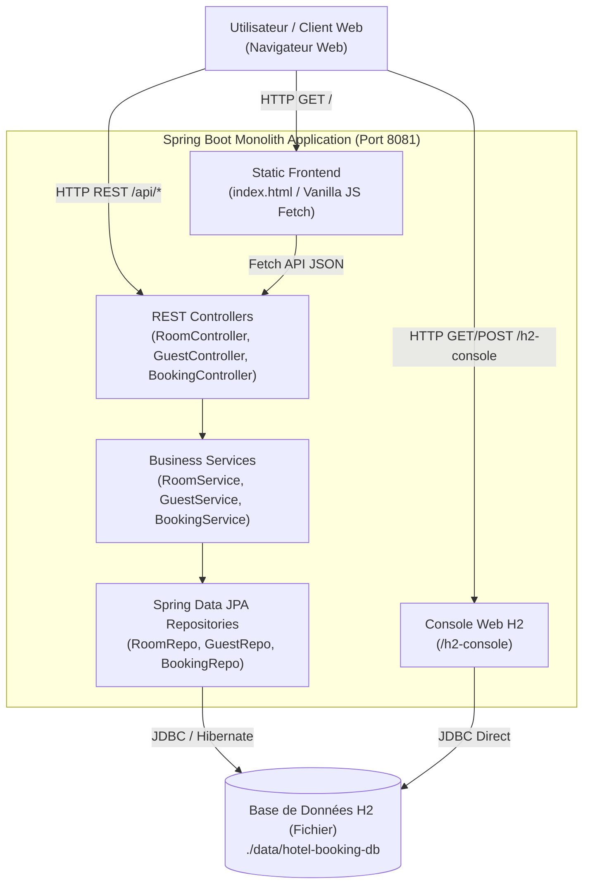
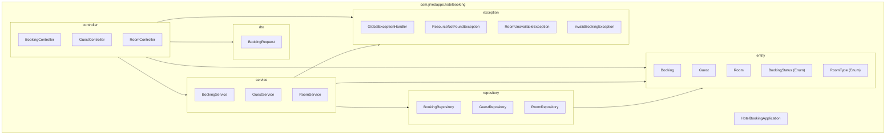
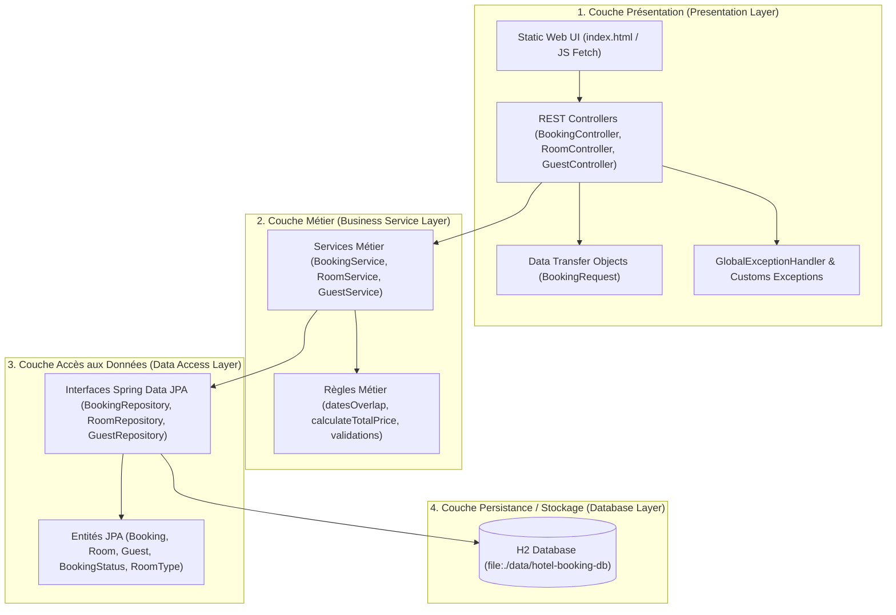
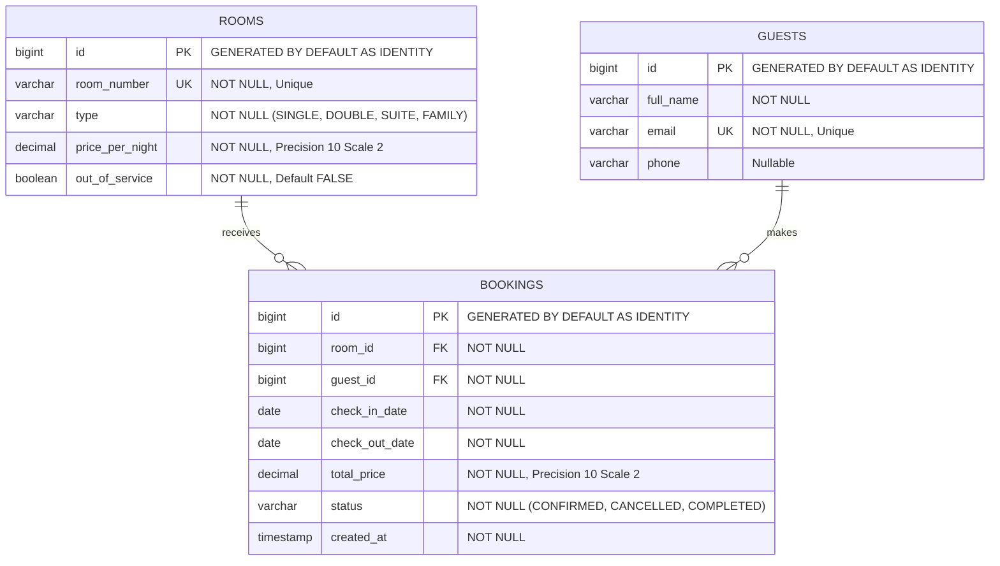
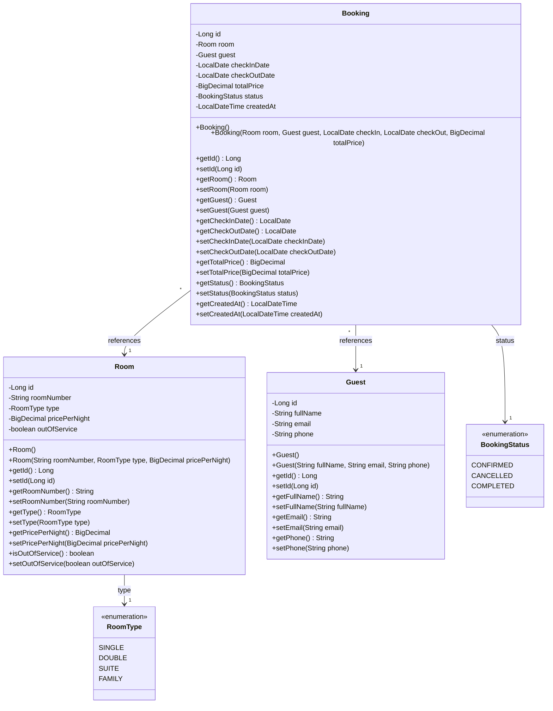
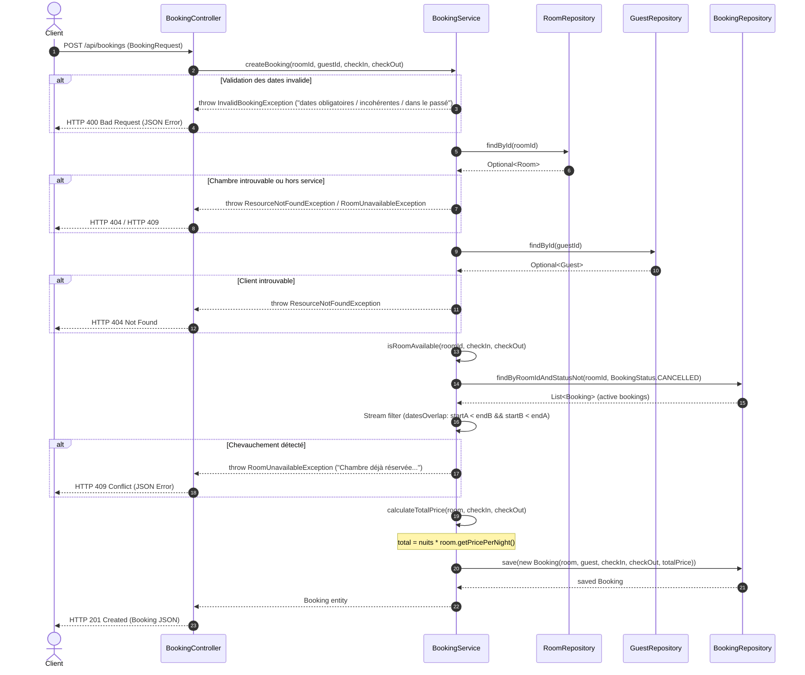
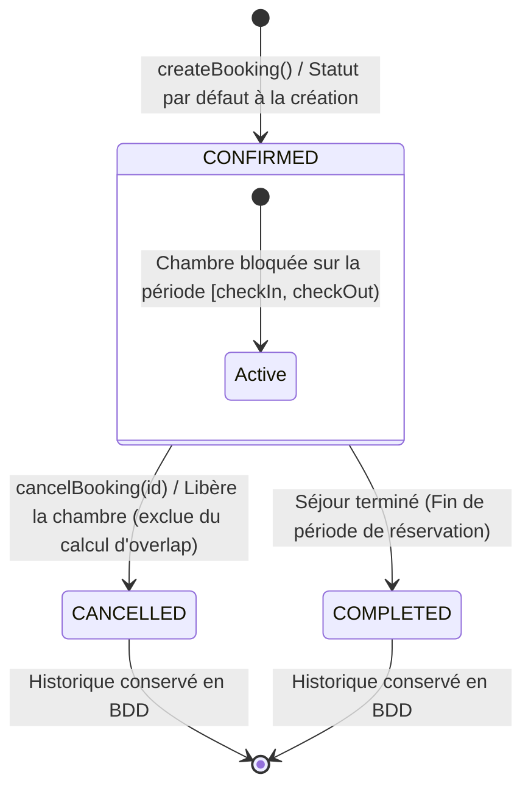
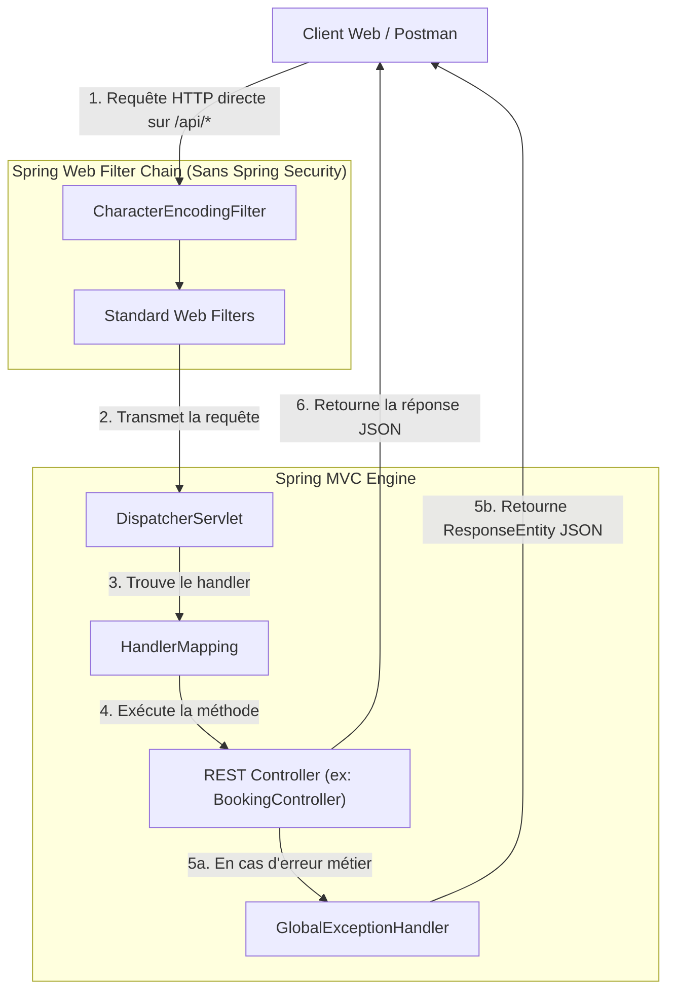
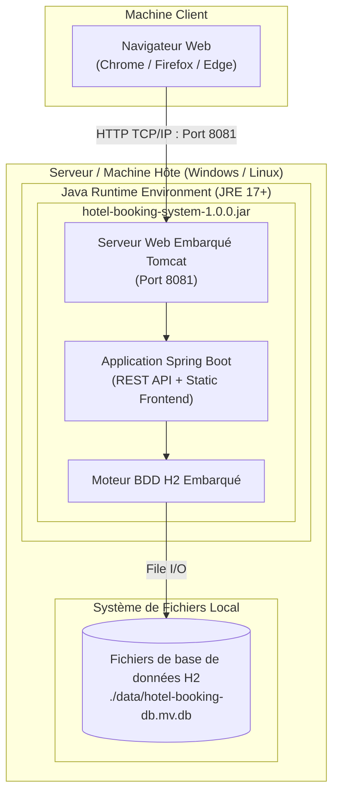

# Hotel Booking System

Systeme de reservation hoteliere : gestion des chambres, des clients et des reservations,
avec detection de chevauchement de dates et calcul automatique du prix total.

## But

Simuler le coeur metier d'un moteur de reservation d'hotel : empecher les doubles reservations
sur une meme chambre, calculer le prix d'un sejour, et liberer une chambre a l'annulation.
Projet de la bibliotheque d'ingenierie personnelle, palier "macro" (application multi-couches
complete, hors microservices).

## Architecture

Application Spring Boot monolithique en couches classiques :

```
controller/   Endpoints REST (Room, Guest, Booking) - validation d'entree, pas de logique metier
service/      Logique metier : chevauchement de dates, calcul de prix, regles de creation/annulation
repository/   Spring Data JPA (interfaces uniquement)
entity/       Room, Guest, Booking + enums RoomType, BookingStatus
dto/          BookingRequest (entree API dediee, distincte de l'entite Booking)
exception/    Exceptions metier + @RestControllerAdvice pour les reponses d'erreur JSON
```

Frontend : une seule page statique (`src/main/resources/static/index.html`) servie directement
par Spring, qui appelle l'API REST en `fetch`. Choix assume : pas d'Angular CLI ni de build
frontend separe pour ce palier de projet — une page HTML/JS suffit a demontrer les flux.

Persistance : H2 en fichier (`./data/hotel-booking-db`), donc les donnees survivent aux
redemarrages de l'application (contrairement a une H2 en memoire).

## Regles metier

- **Chevauchement de dates** : une chambre ne peut pas etre reservee si la periode demandee
  chevauche une reservation active (statut != CANCELLED) existante sur cette chambre.
  Intervalles semi-ouverts `[checkIn, checkOut)` : un checkout et un checkin le meme jour ne
  sont pas consideres comme un conflit. Voir `BookingService.datesOverlap`.
- **Calcul du prix** : `prix total = nombre de nuits x prix/nuit de la chambre`. Le prix/nuit
  est propre a chaque chambre (donc indirectement au type de chambre). Voir
  `BookingService.calculateTotalPrice`.
- **Annulation** : passe la reservation en statut `CANCELLED`, ce qui la retire automatiquement
  du calcul de disponibilite (aucune suppression physique, pour garder l'historique).

## Lancer le projet

Prerequis : Java 17, Maven.

```bash
mvn spring-boot:run
```

L'application demarre sur `http://localhost:8081`. Page de demo : `http://localhost:8081/`.
Console H2 (debug) : `http://localhost:8081/h2-console` (JDBC URL : `jdbc:h2:file:./data/hotel-booking-db`).

## Build et tests

```bash
mvn compile
mvn test
```

## Endpoints principaux

| Methode | URL | Description |
|---|---|---|
| POST | `/api/rooms` | Creer une chambre |
| GET | `/api/rooms` | Lister toutes les chambres |
| GET | `/api/rooms/{id}` | Detail d'une chambre |
| GET | `/api/rooms/available?checkIn=...&checkOut=...` | Chambres disponibles sur une periode |
| POST | `/api/guests` | Creer un client |
| GET | `/api/guests` | Lister les clients |
| POST | `/api/bookings` | Creer une reservation (`roomId`, `guestId`, `checkInDate`, `checkOutDate`) |
| GET | `/api/bookings` | Lister toutes les reservations |
| GET | `/api/bookings/{id}` | Detail d'une reservation |
| GET | `/api/bookings/guest/{guestId}` | Reservations d'un client |
| POST | `/api/bookings/{id}/cancel` | Annuler une reservation (libere la chambre) |

## Limitations connues

- Pas d'authentification/autorisation : tous les endpoints sont ouverts (hors perimetre de ce
  palier, focus sur la logique metier de reservation).
- Pas de gestion de tarification dynamique (saisons, remises, taxes) : le prix est un simple
  `nuits x prix/nuit`.
- Pas de surbooking volontaire ni de liste d'attente.
- La page HTML de demo est volontairement minimale (pas de framework JS, pas de pagination).
- Aucune notion de paiement : une reservation `CONFIRMED` n'implique pas de transaction financiere.


# Architecture et Diagrammes UML / System - Hotel Booking System

Ce document présente l'analyse d'architecture et de conception logicielle du projet macro `hotel-booking-system` basée sur l'inspection réelle du code source (Java 17, Spring Boot 3, Spring Data JPA, H2).

---

## 1. Architecture Overview (C4 Container / Context)

L'architecture de l'application `hotel-booking-system` est un monolithe Spring Boot 3 / Java 17 compact. L'utilisateur interagit à travers une interface web statique à page unique (`index.html`) hébergée directement dans les ressources de l'application. Cette page communique via des requêtes HTTP/REST (API Fetch) avec l'application embarquée sur le port 8081. Le système gère en interne les couches Web REST, Service métier et Persistance JPA. Les données sont stockées de façon permanente dans une base de données embarquée H2 configurée en mode fichier (`./data/hotel-booking-db`), et une console d'administration H2 (`/h2-console`) est activée pour le débogage.



---

## 2. Package Diagram

Le projet suit une organisation par packages techniques sous le package racine `com.jihedapps.hotelbooking`. Le package `controller` expose l'API REST et interagit avec le package `service` pour exécuter la logique métier, ainsi qu'avec `dto` pour recevoir la requête de réservation (`BookingRequest`) et `exception` pour intercepter les erreurs via `@RestControllerAdvice`. Le package `service` applique les règles métier (calcul de prix, non-chevauchement de dates) et communique avec le package `repository`. Enfin, `repository` s'appuie sur le package `entity` pour les opérations de persistance Spring Data JPA.



---

## 3. Layer Diagram

L'application est structurée en 4 couches d'architecture classiques. La couche de Présentation comprend l'interface HTML statique, les contrôleurs REST et le gestionnaire d'exceptions global qui transforme les exceptions métier en réponses HTTP adaptées (400, 404, 409). La couche Métier/Service rassemble la validation des règles de gestion, l'algorithme de détection des chevauchements de dates et le calcul des coûts de séjour. La couche d'Accès aux Données s'appuie sur les interfaces `JpaRepository` de Spring Data. Enfin, la couche de Persistance gère le stockage physique dans la base H2 stockée sur disque.



---

## 4. Component Diagram

Le diagramme de composants décrit la répartition modulaire au sein du conteneur Spring Boot. Les composants front-end (index.html) et d'API REST interagissent via l'interface `/api/*`. Les contrôleurs s'appuient sur les composants de service métier. Le composant `BookingService` agit comme le cœur du domaine en coordonnant les vérifications de disponibilité auprès de `BookingRepository` et `RoomRepository`. Les requêtes JPA s'exécutent au travers de Hibernate pour persister le modèle relationnel dans la base H2.

```mermaid
componentDiagram
    component [Static HTML/JS Client] as WebUI
    
    package "Spring Boot Application Container" {
        component [REST API Controllers\n(Booking, Room, Guest)] as Controllers
        component [Global Exception Handler] as ExceptionHandler
        component [Booking Service Module\n(BookingService)] as BookingSvc
        component [Room & Guest Service Modules\n(RoomService, GuestService)] as CoreSvcs
        component [Spring Data JPA Layer\n(Repositories & Hibernate)] as JPALayer
    }
    
    database "H2 File Database\n(hotel-booking-db)" as DB

    WebUI ..> Controllers : HTTP JSON / REST
    Controllers --> ExceptionHandler : Intercepts Exceptions
    Controllers --> BookingSvc : Call reservation logic
    Controllers --> CoreSvcs : Call room/guest logic
    RoomService ..> BookingSvc : isRoomAvailable check
    BookingSvc --> JPALayer : JPA Queries
    CoreSvcs --> JPALayer : JPA Queries
    JPALayer --> DB : JDBC File I/O
```

---

## 5. ERD (Entity Relationship Diagram)

Le schéma relationnel de la base de données comprend trois tables principales : `rooms`, `guests` et `bookings`. La table `rooms` stocke les informations de chaque chambre avec son type (enum `RoomType`) et son état de service (`out_of_service`). La table `guests` stocke les clients avec une contrainte d'unicité sur l'adresse email. La table `bookings` réalise l'association N-1 avec `rooms` (via `room_id`) et N-1 avec `guests` (via `guest_id`), tout en enregistrant les dates du séjour, le prix total calculé et le statut de la réservation (enum `BookingStatus`).



---

## 6. Class Diagram UML (Main Business Entities)

Le diagramme de classes présente la modélisation objet des entités métier et de leurs énumérations associées dans le package `com.jihedapps.hotelbooking.entity`. La classe `Booking` maintient des références obligatoires vers `Room` et `Guest` (associations ManyToOne). Elle possède également un attribut `BookingStatus` (valeur par défaut `CONFIRMED`) et enregistre la date de création. La classe `Room` est liée à l'énumération `RoomType` et conserve un booléen `outOutOfService` indiquant une indisponibilité administrative.



---

## 7. Sequence Diagram (Booking Creation with Date Overlap & Availability Check)

Ce diagramme de séquence détaille le processus de création d'une réservation (`POST /api/bookings`) exécuté au sein d'une transaction `@Transactional`. Le `BookingController` reçoit le DTO `BookingRequest` et appelle `BookingService.createBooking`. Le service valide d'abord les dates (`checkIn`, `checkOut`), vérifie que la chambre existe et n'est pas hors service (`outOfService`), puis charge l'entité `Guest`. Il procède ensuite au contrôle de disponibilité : `isRoomAvailable` récupère les réservations actives (`status != CANCELLED`) pour la chambre via `BookingRepository` et applique l'algorithme de chevauchement sur des intervalles semi-ouverts `[checkIn, checkOut)`. Si la chambre est libre, le montant total est calculé (`nuits * prix/nuit`) et la réservation est sauvegardée en base de données.



---

## 8. State Diagram (Booking Status Workflow)

Le diagramme d'état illustre le cycle de vie d'une réservation selon les valeurs définies dans l'énumération `BookingStatus`. Lors de sa création réussie via `createBooking()`, la réservation entre directement dans l'état `CONFIRMED`. À partir de cet état, elle peut être annulée via l'appel `POST /api/bookings/{id}/cancel` pour passer à l'état `CANCELLED`, ce qui libère immédiatement la chambre pour les vérifications de chevauchement ultérieures. Le statut `COMPLETED` représente une réservation arrivée à son terme une fois le séjour accompli.



---

## 9. Security Flow Diagram (Open Access Architecture)

Conformément aux choix de conception documentés dans le projet (`pom.xml` et `README.md`), le périmètre de ce projet macro est centré sur le cœur de domaine métier et n'inclut aucune couche d'authentification ou d'autorisation Spring Security. Tous les endpoints `/api/*` sont librement accessibles. Le schéma ci-dessous illustre le flux direct d'une requête HTTP qui franchit la chaîne de filtres Spring Web standard sans interception de sécurité, avant d'être traitée directement par les contrôleurs REST.



---

## 10. Deployment Diagram (Simplified Spring Boot + H2)

Le diagramme de déploiement montre l'infrastructure matérielle et logicielle simplifiée requise pour faire tourner l'application `hotel-booking-system`. L'ensemble s'exécute sur une machine hôte disposant d'un environnement Java (JRE 17+). L'application Spring Boot est empaquetée sous forme de fichier JAR autonome intégrant le serveur Web Tomcat sur le port 8081. Le système de persistance s'appuie sur le moteur H2 embarqué, qui écrit les fichiers de données directement sur le disque local dans le répertoire `./data/hotel-booking-db`.




# Architecture et Diagrammes UML / System - Hotel Booking System

Ce document présente l'analyse d'architecture et de conception logicielle du projet macro `hotel-booking-system` basée sur l'inspection réelle du code source (Java 17, Spring Boot 3, Spring Data JPA, H2).

---

## 1. Architecture Overview (C4 Container / Context)

L'architecture de l'application `hotel-booking-system` est un monolithe Spring Boot 3 / Java 17 compact. L'utilisateur interagit à travers une interface web statique à page unique (`index.html`) hébergée directement dans les ressources de l'application. Cette page communique via des requêtes HTTP/REST (API Fetch) avec l'application embarquée sur le port 8081. Le système gère en interne les couches Web REST, Service métier et Persistance JPA. Les données sont stockées de façon permanente dans une base de données embarquée H2 configurée en mode fichier (`./data/hotel-booking-db`), et une console d'administration H2 (`/h2-console`) est activée pour le débogage.


---

## 2. Package Diagram

Le projet suit une organisation par packages techniques sous le package racine `com.jihedapps.hotelbooking`. Le package `controller` expose l'API REST et interagit avec le package `service` pour exécuter la logique métier, ainsi qu'avec `dto` pour recevoir la requête de réservation (`BookingRequest`) et `exception` pour intercepter les erreurs via `@RestControllerAdvice`. Le package `service` applique les règles métier (calcul de prix, non-chevauchement de dates) et communique avec le package `repository`. Enfin, `repository` s'appuie sur le package `entity` pour les opérations de persistance Spring Data JPA.


---

## 3. Layer Diagram

L'application est structurée en 4 couches d'architecture classiques. La couche de Présentation comprend l'interface HTML statique, les contrôleurs REST et le gestionnaire d'exceptions global qui transforme les exceptions métier en réponses HTTP adaptées (400, 404, 409). La couche Métier/Service rassemble la validation des règles de gestion, l'algorithme de détection des chevauchements de dates et le calcul des coûts de séjour. La couche d'Accès aux Données s'appuie sur les interfaces `JpaRepository` de Spring Data. Enfin, la couche de Persistance gère le stockage physique dans la base H2 stockée sur disque.


---

## 4. Component Diagram

Le diagramme de composants décrit la répartition modulaire au sein du conteneur Spring Boot. Les composants front-end (index.html) et d'API REST interagissent via l'interface `/api/*`. Les contrôleurs s'appuient sur les composants de service métier. Le composant `BookingService` agit comme le cœur du domaine en coordonnant les vérifications de disponibilité auprès de `BookingRepository` et `RoomRepository`. Les requêtes JPA s'exécutent au travers de Hibernate pour persister le modèle relationnel dans la base H2.

```mermaid
componentDiagram
    component [Static HTML/JS Client] as WebUI
    
    package "Spring Boot Application Container" {
        component [REST API Controllers\n(Booking, Room, Guest)] as Controllers
        component [Global Exception Handler] as ExceptionHandler
        component [Booking Service Module\n(BookingService)] as BookingSvc
        component [Room & Guest Service Modules\n(RoomService, GuestService)] as CoreSvcs
        component [Spring Data JPA Layer\n(Repositories & Hibernate)] as JPALayer
    }
    
    database "H2 File Database\n(hotel-booking-db)" as DB

    WebUI ..> Controllers : HTTP JSON / REST
    Controllers --> ExceptionHandler : Intercepts Exceptions
    Controllers --> BookingSvc : Call reservation logic
    Controllers --> CoreSvcs : Call room/guest logic
    RoomService ..> BookingSvc : isRoomAvailable check
    BookingSvc --> JPALayer : JPA Queries
    CoreSvcs --> JPALayer : JPA Queries
    JPALayer --> DB : JDBC File I/O
```

---

## 5. ERD (Entity Relationship Diagram)

Le schéma relationnel de la base de données comprend trois tables principales : `rooms`, `guests` et `bookings`. La table `rooms` stocke les informations de chaque chambre avec son type (enum `RoomType`) et son état de service (`out_of_service`). La table `guests` stocke les clients avec une contrainte d'unicité sur l'adresse email. La table `bookings` réalise l'association N-1 avec `rooms` (via `room_id`) et N-1 avec `guests` (via `guest_id`), tout en enregistrant les dates du séjour, le prix total calculé et le statut de la réservation (enum `BookingStatus`).


---

## 6. Class Diagram UML (Main Business Entities)

Le diagramme de classes présente la modélisation objet des entités métier et de leurs énumérations associées dans le package `com.jihedapps.hotelbooking.entity`. La classe `Booking` maintient des références obligatoires vers `Room` et `Guest` (associations ManyToOne). Elle possède également un attribut `BookingStatus` (valeur par défaut `CONFIRMED`) et enregistre la date de création. La classe `Room` est liée à l'énumération `RoomType` et conserve un booléen `outOutOfService` indiquant une indisponibilité administrative.


---

## 7. Sequence Diagram (Booking Creation with Date Overlap & Availability Check)

Ce diagramme de séquence détaille le processus de création d'une réservation (`POST /api/bookings`) exécuté au sein d'une transaction `@Transactional`. Le `BookingController` reçoit le DTO `BookingRequest` et appelle `BookingService.createBooking`. Le service valide d'abord les dates (`checkIn`, `checkOut`), vérifie que la chambre existe et n'est pas hors service (`outOfService`), puis charge l'entité `Guest`. Il procède ensuite au contrôle de disponibilité : `isRoomAvailable` récupère les réservations actives (`status != CANCELLED`) pour la chambre via `BookingRepository` et applique l'algorithme de chevauchement sur des intervalles semi-ouverts `[checkIn, checkOut)`. Si la chambre est libre, le montant total est calculé (`nuits * prix/nuit`) et la réservation est sauvegardée en base de données.


---

## 8. State Diagram (Booking Status Workflow)

Le diagramme d'état illustre le cycle de vie d'une réservation selon les valeurs définies dans l'énumération `BookingStatus`. Lors de sa création réussie via `createBooking()`, la réservation entre directement dans l'état `CONFIRMED`. À partir de cet état, elle peut être annulée via l'appel `POST /api/bookings/{id}/cancel` pour passer à l'état `CANCELLED`, ce qui libère immédiatement la chambre pour les vérifications de chevauchement ultérieures. Le statut `COMPLETED` représente une réservation arrivée à son terme une fois le séjour accompli.


---

## 9. Security Flow Diagram (Open Access Architecture)

Conformément aux choix de conception documentés dans le projet (`pom.xml` et `README.md`), le périmètre de ce projet macro est centré sur le cœur de domaine métier et n'inclut aucune couche d'authentification ou d'autorisation Spring Security. Tous les endpoints `/api/*` sont librement accessibles. Le schéma ci-dessous illustre le flux direct d'une requête HTTP qui franchit la chaîne de filtres Spring Web standard sans interception de sécurité, avant d'être traitée directement par les contrôleurs REST.


---

## 10. Deployment Diagram (Simplified Spring Boot + H2)

Le diagramme de déploiement montre l'infrastructure matérielle et logicielle simplifiée requise pour faire tourner l'application `hotel-booking-system`. L'ensemble s'exécute sur une machine hôte disposant d'un environnement Java (JRE 17+). L'application Spring Boot est empaquetée sous forme de fichier JAR autonome intégrant le serveur Web Tomcat sur le port 8081. Le système de persistance s'appuie sur le moteur H2 embarqué, qui écrit les fichiers de données directement sur le disque local dans le répertoire `./data/hotel-booking-db`.


