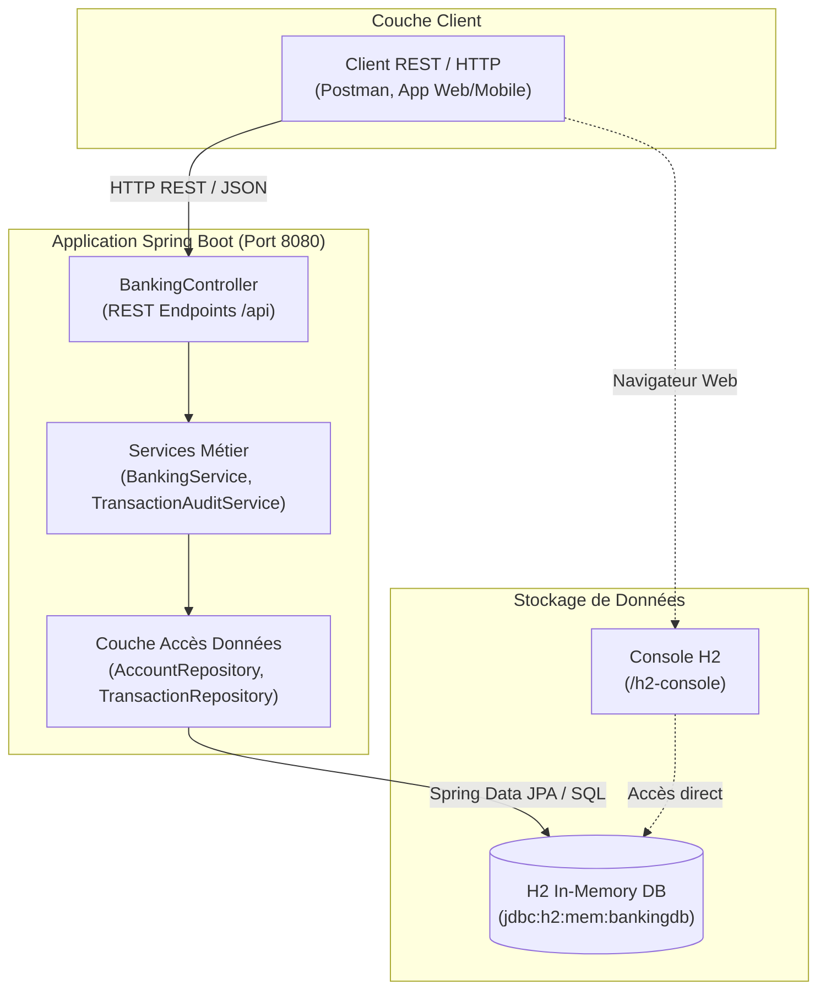
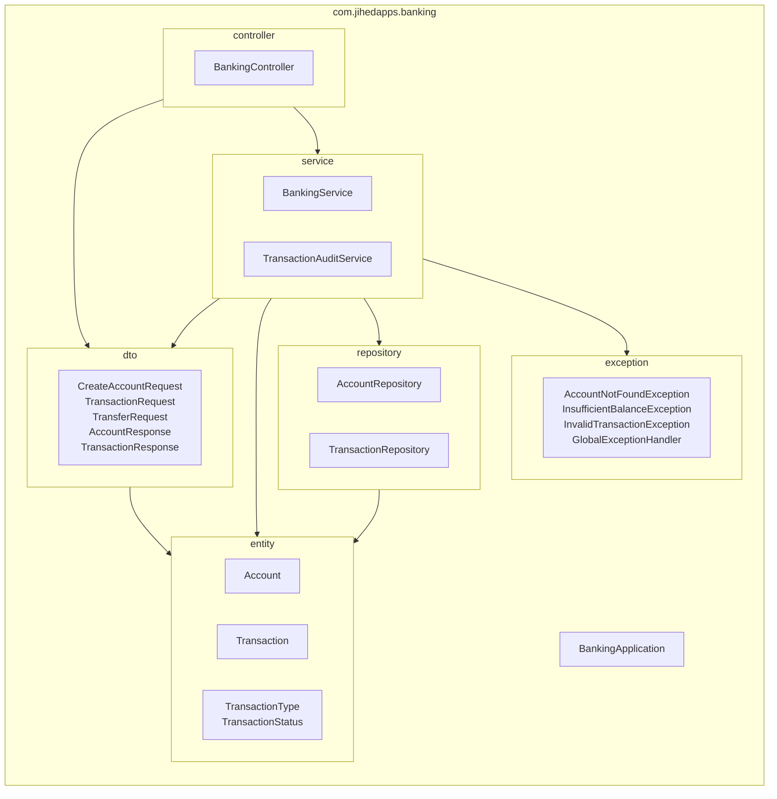
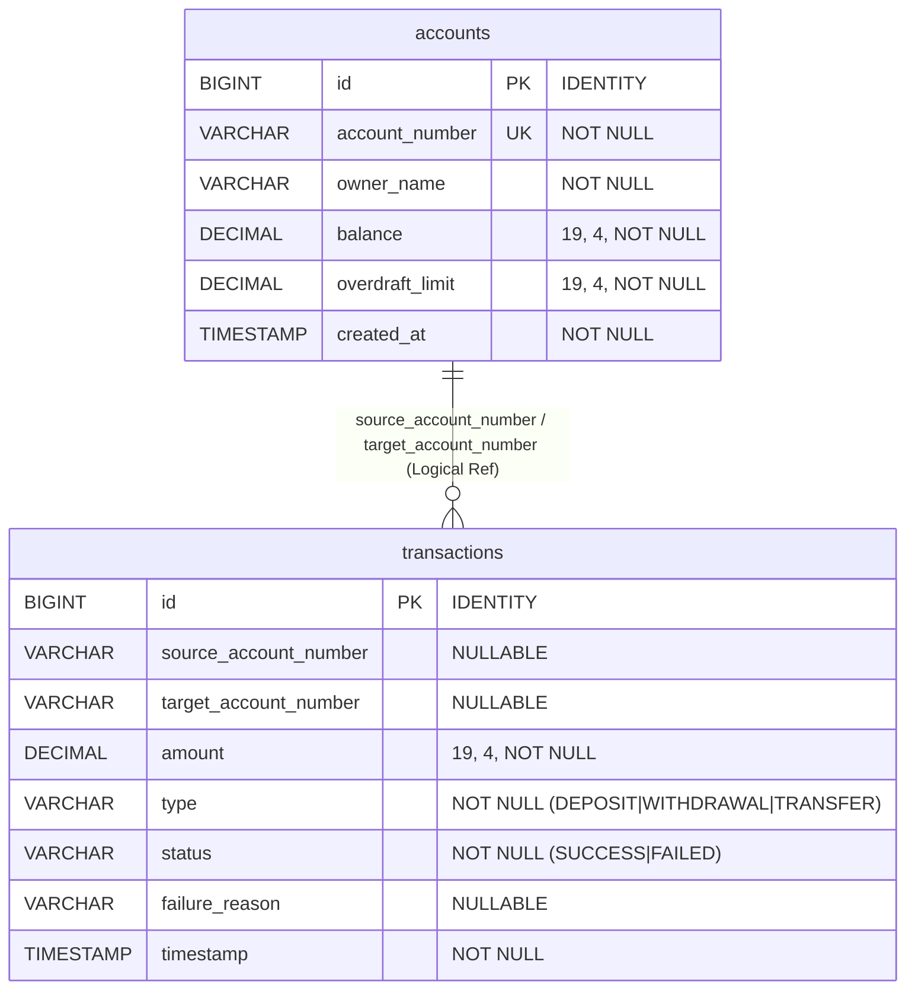
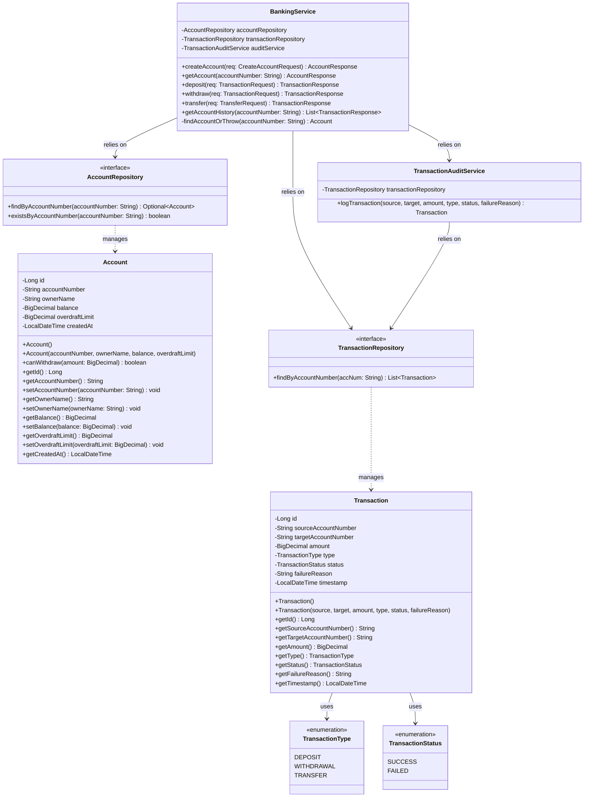
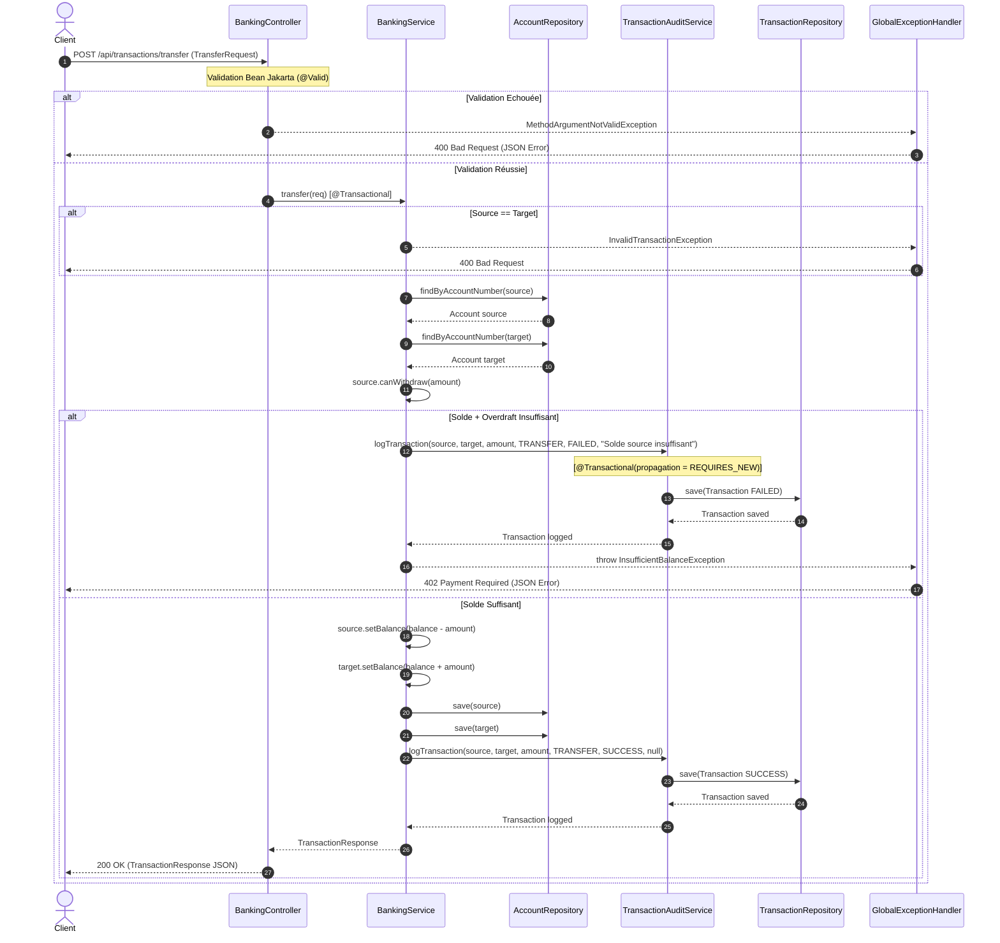
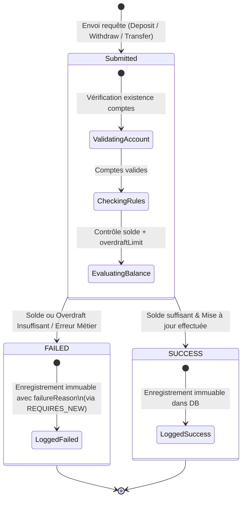
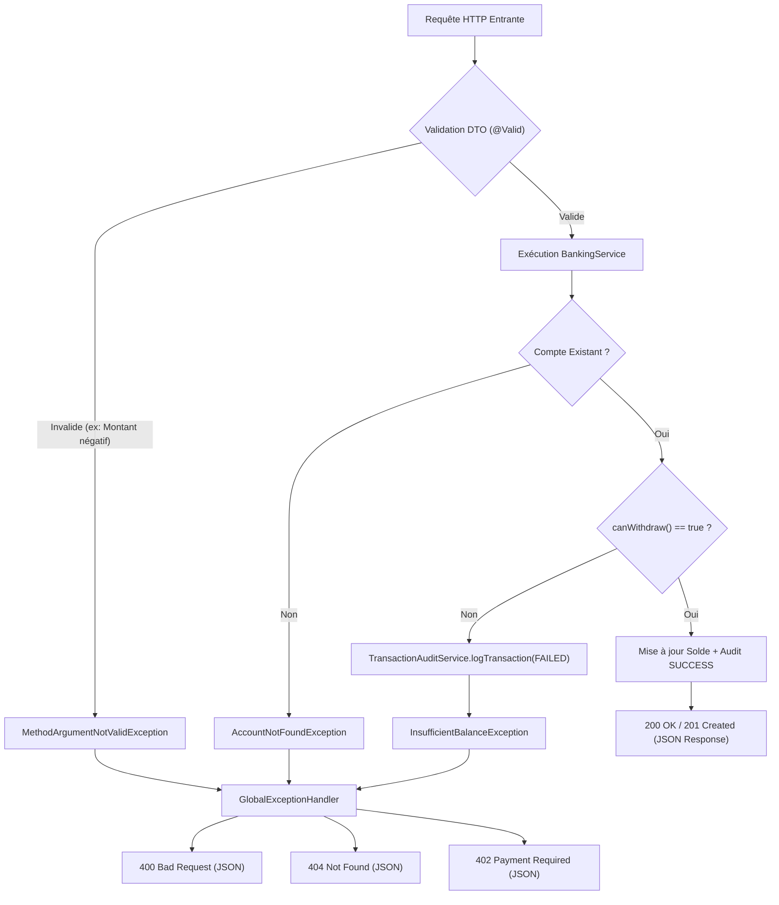

# Mini Banking System

> Core banking backend sécurisé, transactionnel et conforme aux exigences d'audit financier. Développé avec Spring Boot 3.2.5, Java 17 et Spring Data JPA.

## Architecture & Garanties Financières

Ce projet implémente un moteur bancaire minimaliste orienté entreprise garantissant la cohérence stricte des opérations financières et de l'historique comptable.

- **Stack** : Java 17, Spring Boot 3.2.5, Spring Data JPA, Base de données H2, Validation Spring Boot.
- **Règles Métier Financières** :
  - **Gestion du découvert configurabilité** : Retraits et virements autorisés jusqu'au plafond `balance + overdraftLimit`.
  - **Atomicités des virements (`@Transactional`)** : Débit du compte source et crédit du compte destinataire exécutés au sein d'une transaction unique. En cas d'erreur, annulation intégrale (`rollback`).
  - **Journal d'Audit Immuable (Append-Only Audit Log)** : Chaque opération (réussie ou échouée) génère un enregistrement de transaction immuable avec horodatage et motif d'échec en cas d'erreur.
  - **Gestion globale des exceptions REST** : Réponses HTTP normalisées (`402 Payment Required` si solde insuffisant, `404 Not Found`, `400 Bad Request`).

## Structure du Projet

```text
mini-banking-system/
├── src/main/java/com/jihedapps/banking/
│   ├── controller/      # Endpoints REST (Accounts, Transactions, History)
│   ├── dto/             # Objets de transfert de données et validations
│   ├── entity/          # Entités JPA (Account, Transaction, Enums)
│   ├── exception/       # Exceptions métier et GlobalExceptionHandler
│   ├── repository/      # Repositories JPA avec requêtes JPQL
│   └── service/         # Logique métier transactionnelle
└── src/test/java/       # Tests d'intégration JUnit 5 / Spring Boot Test
```

## Démarrage Rapide

### Compiler et exécuter les tests

```bash
mvn clean test
```

### Lancer l'application

```bash
mvn spring-boot:run
```

L'application démarre sur `http://localhost:8080`. La console H2 est accessible sur `http://localhost:8080/h2-console`.

## Endpoints API

| Méthode | Endpoint | Description | HTTP Code Succès |
| :--- | :--- | :--- | :--- |
| `POST` | `/api/accounts` | Création d'un compte bancaire | `201 Created` |
| `GET` | `/api/accounts/{accountNumber}` | Solde et détails d'un compte | `200 OK` |
| `POST` | `/api/transactions/deposit` | Dépôt sur un compte | `200 OK` |
| `POST` | `/api/transactions/withdraw` | Retrait d'un compte | `200 OK` |
| `POST` | `/api/transactions/transfer` | Virement atomique entre 2 comptes | `200 OK` |
| `GET` | `/api/transactions/{accountNumber}/history` | Historique complet d'audit d'un compte | `200 OK` |


# System Architecture & Technical Specifications: Mini Banking System

Ce document présente l'analyse d'architecture et de conception logicielle du projet `mini-banking-system`. Réalisé avec Spring Boot 3.2.5 et Java 17, ce micro-service bancaire assure la gestion transactionnelle atomique des comptes et la traçabilité immuable des opérations financières.

---

### 1. Architecture Overview (C4 Container)

Le schéma C4 Container illustre la vue d'ensemble de l'application `mini-banking-system`. L'utilisateur ou client HTTP communique avec le conteneur Spring Boot via des requêtes REST/JSON sur le port 8080. En interne, l'application est structurée en contrôleurs, services applicatifs et dépôts de données accédant à une base de données H2 en mémoire (`jdbc:h2:mem:bankingdb`), avec la console H2 exposée sur `/h2-console`.



---

### 2. Package Diagram

Le diagramme de paquetages représente la structure modulaire de l'application sous le paquetage racine `com.jihedapps.banking`. La communication suit une architecture en couches strictes où `controller` dépend de `dto` et `service`, `service` orchestre la logique en dépendant de `repository`, `entity`, `dto` et `exception`, et `repository` interagit directement avec `entity`.



---

### 3. Layer Diagram

Le diagramme en couches met en évidence la séparation des responsabilités au sein de l'application (4 tiers). La couche Web réceptionne et valide les DTOs, la couche Service gère l'atomicité transactionnelle et la journalisation d'audit immuable avec propagation `REQUIRES_NEW`, la couche Persistence définit les interfaces `JpaRepository` avec requêtes JPQL sur mesure, et la couche Base de Données assure le stockage persistant H2.

```mermaid
graph TB
    subgraph PresentationLayer ["1. Presentation Layer (Web / REST)"]
        BC["BankingController"]
        GEH["GlobalExceptionHandler"]
        DTO["DTOs (CreateAccountRequest, TransferRequest, etc.)"]
    end

    subgraph ServiceLayer ["2. Business / Service Layer"]
        BS["BankingService (@Transactional)"]
        TAS["TransactionAuditService (@Transactional REQUIRES_NEW)"]
    end

    subgraph PersistenceLayer ["3. Data Access / Repository Layer"]
        AR["AccountRepository (JpaRepository)"]
        TR["TransactionRepository (JpaRepository + JPQL)"]
    end

    subgraph DatabaseLayer ["4. Infrastructure / Database Layer"]
        H2[("H2 In-Memory DB (Hibernate / DDL Auto)")]
    end

    BC --> BS
    BC --> DTO
    GEH ..-> BC : "Intercepte exceptions"
    BS --> TAS
    BS --> AR
    BS --> TR
    TAS --> TR
    AR --> H2
    TR --> H2
```

---

### 4. Component Diagram

Le diagramme de composants décrit la structure interne des beans Spring de l'application et leurs dépendances d'injection de constructeur. `BankingController` dépend directement de `BankingService`. `BankingService` dépend d'`AccountRepository`, `TransactionRepository` et `TransactionAuditService`. `TransactionAuditService` possède sa propre dépendance vers `TransactionRepository` afin d'exécuter l'enregistrement des audits d'échec isolés de la transaction principale.

```mermaid
graph LR
    subgraph Controllers ["Contrôleurs REST"]
        [BankingController]
        [GlobalExceptionHandler]
    end

    subgraph Services ["Services Métier"]
        [BankingService]
        [TransactionAuditService]
    end

    subgraph Repositories ["Dépôts Spring Data JPA"]
        [AccountRepository]
        [TransactionRepository]
    end

    subgraph Entities ["Entités JPA & Modèle"]
        [Account Entity]
        [Transaction Entity]
    end

    [BankingController] -->|Injecte| [BankingService]
    [BankingService] -->|Injecte| [AccountRepository]
    [BankingService] -->|Injecte| [TransactionRepository]
    [BankingService] -->|Injecte| [TransactionAuditService]
    [TransactionAuditService] -->|Injecte| [TransactionRepository]
    
    [AccountRepository] ..->|Gère| [Account Entity]
    [TransactionRepository] ..->|Gère| [Transaction Entity]
    [GlobalExceptionHandler] ..->|Intercepte| [BankingController]
```

---

### 5. ERD (Entity Relationship Diagram)

Le diagramme Entity-Relationship (ERD) montre le schéma relationnel de la base de données H2 généré par Hibernate à partir des annotations Jakarta Persistence (`@Entity`, `@Table`). La table `accounts` contient les informations de solde et de découvert autorisé. La table `transactions` enregistre chaque mouvement financier de manière immuable avec le type (`DEPOSIT`, `WITHDRAWAL`, `TRANSFER`), le statut (`SUCCESS`, `FAILED`) et les numéros de comptes source et cible sous forme de références logiques (`source_account_number`, `target_account_number`).



---

### 6. Class Diagram UML

Le diagramme de classes UML présente la structure des entités métier principales (`Account`, `Transaction`), leurs énumérations associées (`TransactionType`, `TransactionStatus`), ainsi que les services et dépôts qui manipulent ce domaine. La méthode métier `canWithdraw(amount)` centralise la vérification du découvert autorisé directement dans l'entité `Account`.



---

### 7. Sequence Diagram (POST /api/transactions/transfer)

Le diagramme de séquence retrace le flux d'exécution complet lors de l'appel au service de virement atomique (`POST /api/transactions/transfer`). Il illustre la double branche : en cas de solde insuffisant (incluant le découvert autorisée), l'opération est auditée avec le statut `FAILED` au moyen de la transaction autonome `TransactionAuditService` (`REQUIRES_NEW`), puis une exception `InsufficientBalanceException` est levée et convertie en réponse HTTP `402 Payment Required` par le `GlobalExceptionHandler`. En cas de succès, les deux comptes sont mis à jour au sein de la transaction courante et l'audit enregistre `SUCCESS`.



---

### 8. State Diagram (Transaction Status)

Le diagramme d'états décrit le cycle de vie d'une transaction dans l'application. Une transaction est instanciée lors de la réception d'une demande de dépôt, retrait ou virement, puis passe directement à un état final persistant immuable (`SUCCESS` ou `FAILED`) selon les résultats de la validation des règles de solde et de découvert.



---

### 9. Security & Exception Handling Flow

Le diagramme de flux de sécurité et de gestion des erreurs illustre l'absence de Spring Security explicite (selon le `pom.xml`) et se concentre sur le pipeline de validation de sécurité applicative, la gestion fine des exceptions et l'isolation transactionnelle. Les erreurs de validation d'entrée ou de solde sont interceptées par le `GlobalExceptionHandler` pour garantir une réponse REST standardisée.



---

### 10. Deployment Diagram

Le diagramme de déploiement montre l'environnement d'exécution physique et logique de l'application `mini-banking-system`. L'application Spring Boot s'exécute dans un processus JVM Java 17 embarquant un serveur Web Tomcat sur le port 8080 et une base de données H2 `in-memory`.

```mermaid
deployment
    node "Machine Hôte / Serveur Applicatif" {
        node "JVM 17 Environment" {
            artifact "mini-banking-system-1.0.0-SNAPSHOT.jar" {
                component "Spring Boot 3.2.5 Application Engine"
                component "Tomcat Embedded Web Server (Port 8080)"
                component "H2 Engine (In-Memory JDBC)"
            }
        }
    }

    node "Clients Externes" {
        component "Postman / Client HTTP"
        component "Navigateur Web (Console H2)"
    }

    "Postman / Client HTTP" -- "HTTP / REST (Port 8080)" --> "Tomcat Embedded Web Server (Port 8080)"
    "Navigateur Web (Console H2)" -- "HTTP / /h2-console" --> "Tomcat Embedded Web Server (Port 8080)"
    "Spring Boot 3.2.5 Application Engine" -- "JDBC In-Memory" --> "H2 Engine (In-Memory JDBC)"
```


# System Architecture & Technical Specifications: Mini Banking System

Ce document présente l'analyse d'architecture et de conception logicielle du projet `mini-banking-system`. Réalisé avec Spring Boot 3.2.5 et Java 17, ce micro-service bancaire assure la gestion transactionnelle atomique des comptes et la traçabilité immuable des opérations financières.

---

### 1. Architecture Overview (C4 Container)

Le schéma C4 Container illustre la vue d'ensemble de l'application `mini-banking-system`. L'utilisateur ou client HTTP communique avec le conteneur Spring Boot via des requêtes REST/JSON sur le port 8080. En interne, l'application est structurée en contrôleurs, services applicatifs et dépôts de données accédant à une base de données H2 en mémoire (`jdbc:h2:mem:bankingdb`), avec la console H2 exposée sur `/h2-console`.


---

### 2. Package Diagram

Le diagramme de paquetages représente la structure modulaire de l'application sous le paquetage racine `com.jihedapps.banking`. La communication suit une architecture en couches strictes où `controller` dépend de `dto` et `service`, `service` orchestre la logique en dépendant de `repository`, `entity`, `dto` et `exception`, et `repository` interagit directement avec `entity`.


---

### 3. Layer Diagram

Le diagramme en couches met en évidence la séparation des responsabilités au sein de l'application (4 tiers). La couche Web réceptionne et valide les DTOs, la couche Service gère l'atomicité transactionnelle et la journalisation d'audit immuable avec propagation `REQUIRES_NEW`, la couche Persistence définit les interfaces `JpaRepository` avec requêtes JPQL sur mesure, et la couche Base de Données assure le stockage persistant H2.

```mermaid
graph TB
    subgraph PresentationLayer ["1. Presentation Layer (Web / REST)"]
        BC["BankingController"]
        GEH["GlobalExceptionHandler"]
        DTO["DTOs (CreateAccountRequest, TransferRequest, etc.)"]
    end

    subgraph ServiceLayer ["2. Business / Service Layer"]
        BS["BankingService (@Transactional)"]
        TAS["TransactionAuditService (@Transactional REQUIRES_NEW)"]
    end

    subgraph PersistenceLayer ["3. Data Access / Repository Layer"]
        AR["AccountRepository (JpaRepository)"]
        TR["TransactionRepository (JpaRepository + JPQL)"]
    end

    subgraph DatabaseLayer ["4. Infrastructure / Database Layer"]
        H2[("H2 In-Memory DB (Hibernate / DDL Auto)")]
    end

    BC --> BS
    BC --> DTO
    GEH ..-> BC : "Intercepte exceptions"
    BS --> TAS
    BS --> AR
    BS --> TR
    TAS --> TR
    AR --> H2
    TR --> H2
```

---

### 4. Component Diagram

Le diagramme de composants décrit la structure interne des beans Spring de l'application et leurs dépendances d'injection de constructeur. `BankingController` dépend directement de `BankingService`. `BankingService` dépend d'`AccountRepository`, `TransactionRepository` et `TransactionAuditService`. `TransactionAuditService` possède sa propre dépendance vers `TransactionRepository` afin d'exécuter l'enregistrement des audits d'échec isolés de la transaction principale.

```mermaid
graph LR
    subgraph Controllers ["Contrôleurs REST"]
        [BankingController]
        [GlobalExceptionHandler]
    end

    subgraph Services ["Services Métier"]
        [BankingService]
        [TransactionAuditService]
    end

    subgraph Repositories ["Dépôts Spring Data JPA"]
        [AccountRepository]
        [TransactionRepository]
    end

    subgraph Entities ["Entités JPA & Modèle"]
        [Account Entity]
        [Transaction Entity]
    end

    [BankingController] -->|Injecte| [BankingService]
    [BankingService] -->|Injecte| [AccountRepository]
    [BankingService] -->|Injecte| [TransactionRepository]
    [BankingService] -->|Injecte| [TransactionAuditService]
    [TransactionAuditService] -->|Injecte| [TransactionRepository]
    
    [AccountRepository] ..->|Gère| [Account Entity]
    [TransactionRepository] ..->|Gère| [Transaction Entity]
    [GlobalExceptionHandler] ..->|Intercepte| [BankingController]
```

---

### 5. ERD (Entity Relationship Diagram)

Le diagramme Entity-Relationship (ERD) montre le schéma relationnel de la base de données H2 généré par Hibernate à partir des annotations Jakarta Persistence (`@Entity`, `@Table`). La table `accounts` contient les informations de solde et de découvert autorisé. La table `transactions` enregistre chaque mouvement financier de manière immuable avec le type (`DEPOSIT`, `WITHDRAWAL`, `TRANSFER`), le statut (`SUCCESS`, `FAILED`) et les numéros de comptes source et cible sous forme de références logiques (`source_account_number`, `target_account_number`).


---

### 6. Class Diagram UML

Le diagramme de classes UML présente la structure des entités métier principales (`Account`, `Transaction`), leurs énumérations associées (`TransactionType`, `TransactionStatus`), ainsi que les services et dépôts qui manipulent ce domaine. La méthode métier `canWithdraw(amount)` centralise la vérification du découvert autorisé directement dans l'entité `Account`.


---

### 7. Sequence Diagram (POST /api/transactions/transfer)

Le diagramme de séquence retrace le flux d'exécution complet lors de l'appel au service de virement atomique (`POST /api/transactions/transfer`). Il illustre la double branche : en cas de solde insuffisant (incluant le découvert autorisée), l'opération est auditée avec le statut `FAILED` au moyen de la transaction autonome `TransactionAuditService` (`REQUIRES_NEW`), puis une exception `InsufficientBalanceException` est levée et convertie en réponse HTTP `402 Payment Required` par le `GlobalExceptionHandler`. En cas de succès, les deux comptes sont mis à jour au sein de la transaction courante et l'audit enregistre `SUCCESS`.


---

### 8. State Diagram (Transaction Status)

Le diagramme d'états décrit le cycle de vie d'une transaction dans l'application. Une transaction est instanciée lors de la réception d'une demande de dépôt, retrait ou virement, puis passe directement à un état final persistant immuable (`SUCCESS` ou `FAILED`) selon les résultats de la validation des règles de solde et de découvert.


---

### 9. Security & Exception Handling Flow

Le diagramme de flux de sécurité et de gestion des erreurs illustre l'absence de Spring Security explicite (selon le `pom.xml`) et se concentre sur le pipeline de validation de sécurité applicative, la gestion fine des exceptions et l'isolation transactionnelle. Les erreurs de validation d'entrée ou de solde sont interceptées par le `GlobalExceptionHandler` pour garantir une réponse REST standardisée.


---

### 10. Deployment Diagram

Le diagramme de déploiement montre l'environnement d'exécution physique et logique de l'application `mini-banking-system`. L'application Spring Boot s'exécute dans un processus JVM Java 17 embarquant un serveur Web Tomcat sur le port 8080 et une base de données H2 `in-memory`.

```mermaid
deployment
    node "Machine Hôte / Serveur Applicatif" {
        node "JVM 17 Environment" {
            artifact "mini-banking-system-1.0.0-SNAPSHOT.jar" {
                component "Spring Boot 3.2.5 Application Engine"
                component "Tomcat Embedded Web Server (Port 8080)"
                component "H2 Engine (In-Memory JDBC)"
            }
        }
    }

    node "Clients Externes" {
        component "Postman / Client HTTP"
        component "Navigateur Web (Console H2)"
    }

    "Postman / Client HTTP" -- "HTTP / REST (Port 8080)" --> "Tomcat Embedded Web Server (Port 8080)"
    "Navigateur Web (Console H2)" -- "HTTP / /h2-console" --> "Tomcat Embedded Web Server (Port 8080)"
    "Spring Boot 3.2.5 Application Engine" -- "JDBC In-Memory" --> "H2 Engine (In-Memory JDBC)"
```
