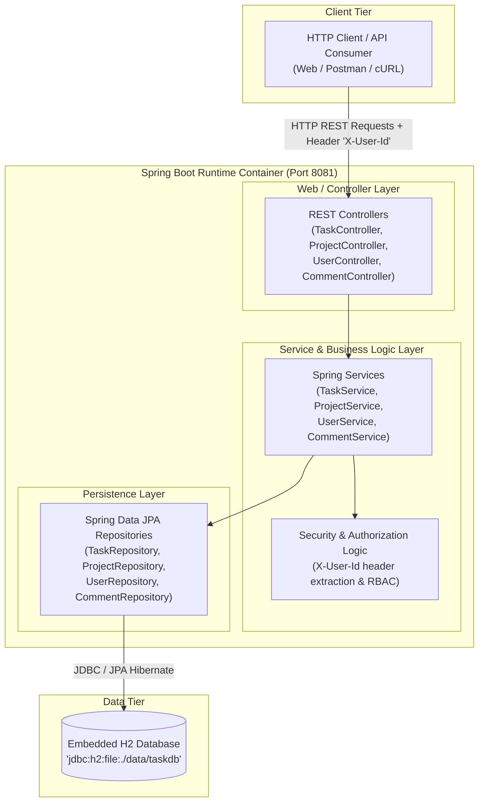
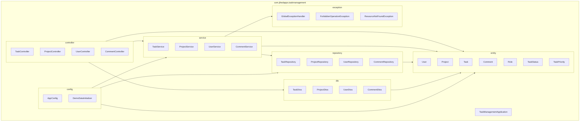
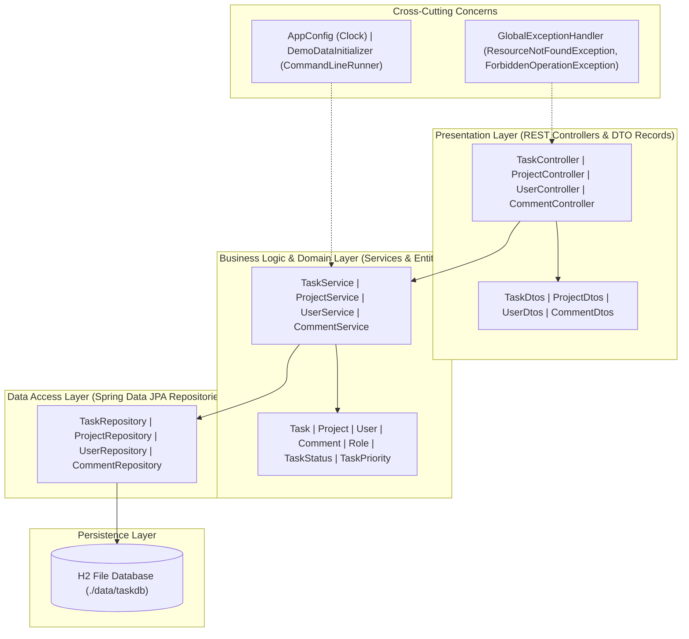
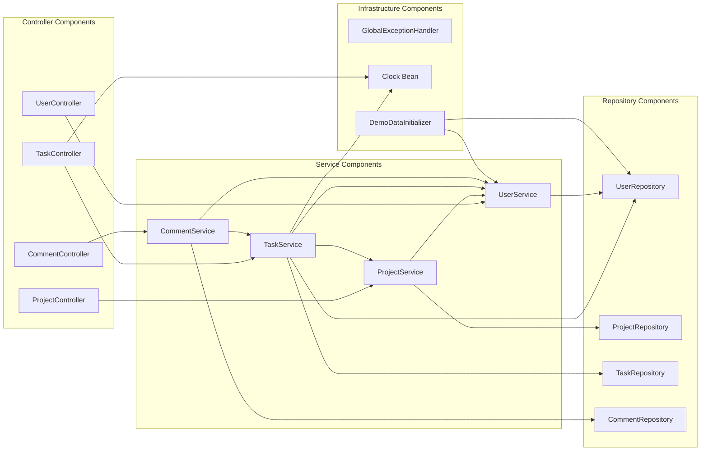
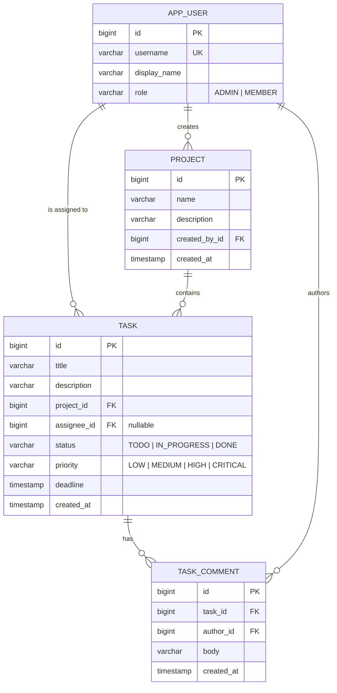
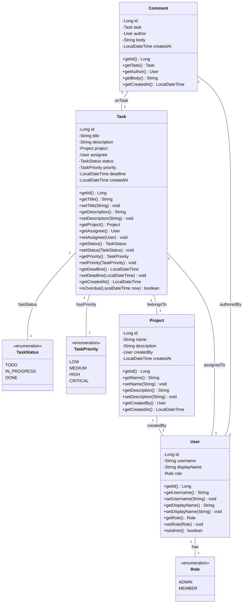
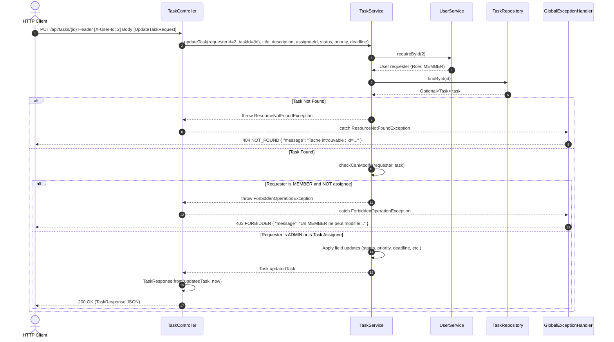
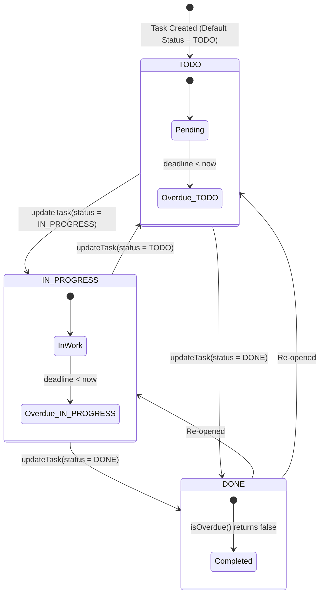
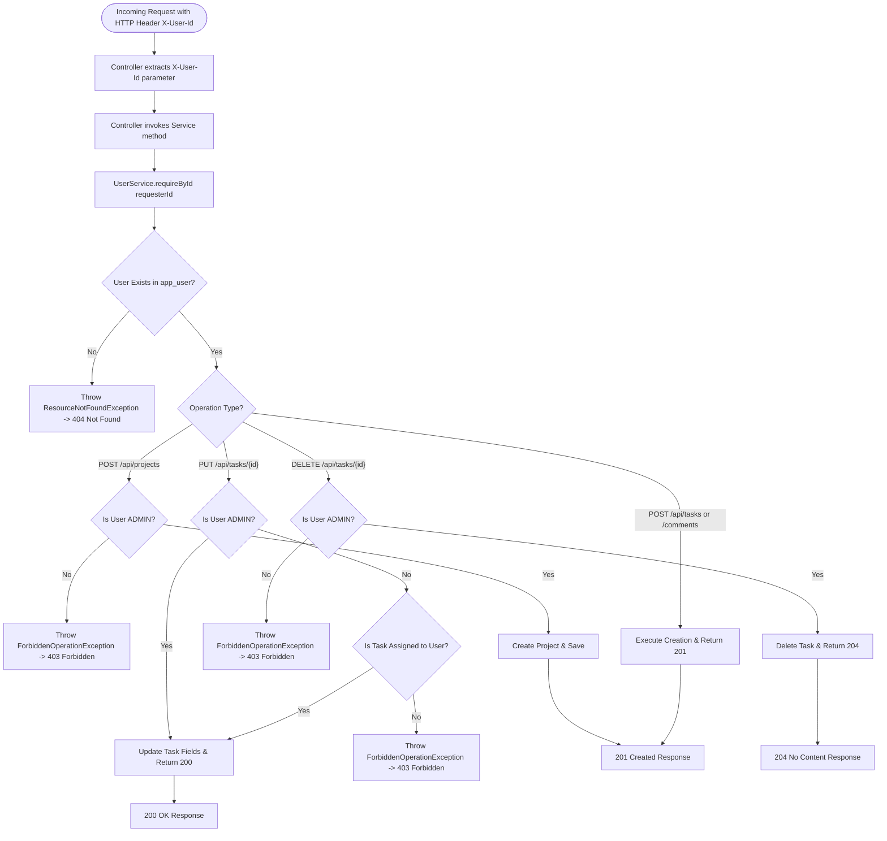

# Task Management Platform

API REST de gestion de projets et de taches d'equipe, avec deux roles distincts (ADMIN, MEMBER)
et des regles d'autorisation appliquees au niveau service.

## But

Simuler un outil de suivi de taches type Jira simplifie : un ADMIN cree les projets et pilote
l'ensemble des taches, un MEMBER ne peut agir que sur les taches qui lui sont assignees. Le
systeme expose aussi une detection explicite des taches en retard.

## Architecture

Monolithe Spring Boot en couches, module Maven unique :

| Couche | Package | Role |
|---|---|---|
| Controller | `com.jihedapps.taskmanagement.controller` | Endpoints REST, mapping DTO <-> service, codes HTTP |
| Service | `com.jihedapps.taskmanagement.service` | Regles metier et autorisations, transactions |
| Repository | `com.jihedapps.taskmanagement.repository` | Acces donnees via Spring Data JPA |
| Entity | `com.jihedapps.taskmanagement.entity` | Modele de domaine (User, Project, Task, Comment) |
| DTO | `com.jihedapps.taskmanagement.dto` | Contrats d'entree/sortie de l'API (records) |
| Exception | `com.jihedapps.taskmanagement.exception` | Exceptions metier + `@RestControllerAdvice` |
| Config | `com.jihedapps.taskmanagement.config` | Bean `Clock`, jeu de donnees de demonstration |

Modele de domaine : `User(role)` -> `Project` -> `Task(assignee, status, priority, deadline)` -> `Comment`.

### Authentification simplifiee

Pas de Spring Security dans cette demonstration : l'identite de l'appelant est transmise via
l'en-tete HTTP `X-User-Id` (id d'un `User` existant). Chaque service verifie le role et la
relation avec la ressource a partir de cet id. C'est un choix assume pour rester dans le
perimetre "macro-project" sans y consacrer un chantier d'authentification complet — voir
limitations ci-dessous.

## Lancer le projet

```bash
mvn spring-boot:run
```

L'application demarre sur `http://localhost:8081`. Une base H2 fichier est creee dans
`./data/taskdb.mv.db` au premier lancement, avec deux utilisateurs de demonstration
(`admin`, id 1, role ADMIN ; `jihed`, id 2, role MEMBER).

Console H2 : `http://localhost:8081/h2-console` (JDBC URL `jdbc:h2:file:./data/taskdb`, user `sa`,
mot de passe vide).

## Endpoints principaux

| Methode | Endpoint | Regle |
|---|---|---|
| `GET /api/users` | Liste des utilisateurs | libre |
| `POST /api/projects` | Creer un projet | `X-User-Id` doit etre un ADMIN |
| `GET /api/projects` | Lister les projets | libre |
| `POST /api/tasks` | Creer une tache | ADMIN ou MEMBER |
| `PUT /api/tasks/{id}` | Modifier une tache | ADMIN, ou MEMBER si `assignee == X-User-Id` |
| `DELETE /api/tasks/{id}` | Supprimer une tache | ADMIN uniquement |
| `GET /api/tasks/overdue` | Taches en retard (deadline depassee, statut != DONE) | libre |
| `POST /api/tasks/{taskId}/comments` | Commenter une tache | utilisateur existant |

Exemple :

```bash
curl -X POST http://localhost:8081/api/projects \
  -H "X-User-Id: 1" -H "Content-Type: application/json" \
  -d '{"name":"Migration cloud","description":"Refonte infra"}'
```

## Regles metier couvertes par les tests

- `TaskServiceTest` : un ADMIN peut modifier/supprimer n'importe quelle tache ; un MEMBER ne peut
  modifier que les taches qui lui sont assignees (et ne peut jamais supprimer) ; detection des
  taches en retard (`deadline < now && status != DONE`), y compris le cas DONE jamais en retard.
- `ProjectServiceTest` : seul un ADMIN peut creer un projet.

## Limitations connues

- Pas d'authentification reelle (JWT/session) : `X-User-Id` est un en-tete de confiance, a ne
  jamais reproduire tel quel en production.
- Pas de pagination sur les listes (`GET /api/tasks`, `/api/projects`) : acceptable au volume de
  demonstration, a ajouter avant un usage reel.
- Pas de suppression en cascade documentee au-dela de JPA par defaut : supprimer un projet avec
  des taches actives n'est pas gere explicitement.
- Frontend : page statique d'information uniquement (`src/main/resources/static/index.html`),
  pas d'UI de gestion — usage prevu via API/HTTP client, conformement au choix de stack du
  palier "macro-projects".


# Architecture & Design Diagrams - Task Management Platform

## 1. Architecture Overview (C4 Container / Context)

The Architecture Overview diagram presents the macro-level system context and container view for the `task-management-platform`. HTTP clients (such as web browsers or API testing tools) interact via REST over HTTP on port 8081, passing user identity in the custom `X-User-Id` request header. The core application runs as a Spring Boot application container hosting Spring MVC controllers, domain services, and Spring Data JPA repositories, which read/write data to an embedded file-based H2 database stored at `./data/taskdb`.



---

## 2. Package Diagram

The Package Diagram illustrates the package structure under `com.jihedapps.taskmanagement`. The application adheres to clean package-by-layer organization: `controller` (REST endpoints), `dto` (Java records for request/response bodies), `service` (business rules and authorization checks), `repository` (Spring Data JPA interfaces), `entity` (JPA models and enums), `config` (Spring bean configurations and seed data initializer), `exception` (global exception handling), and the main entry point `TaskManagementApplication`.



---

## 3. Layer Diagram

The Layer Diagram highlights the separation of concerns across architectural layers. Requests enter the Presentation Layer, flow down to the Service/Domain Layer for validation and RBAC checks (`checkCanModify`), proceed to the Data Access Layer (Repositories), and are executed against the Persistence Layer (H2 DB). Cross-cutting components like `GlobalExceptionHandler` and `AppConfig` supply error handling and shared infrastructure beans across layers.



---

## 4. Component Diagram

The Component Diagram details the internal Spring bean wiring and service interdependencies. `TaskController`, `ProjectController`, `UserController`, and `CommentController` process endpoint mapping and input validation. `TaskService` collaborates with `UserService` and `ProjectService` to validate user rights and project existences. `DemoDataInitializer` seeds default data on startup via `UserService` and `UserRepository`.



---

## 5. ERD (Entity Relationship Diagram)

The ERD shows the database schema derived from the JPA mapping annotations `@Entity`, `@Table`, and `@ManyToOne`. Four main tables are defined: `app_user`, `project`, `task`, and `task_comment`. Multiplicities reflect domain constraints (e.g., a project is created by 1 user; a task belongs to 1 project and optionally 1 assigned user; a task can have 0 to many comments).



---

## 6. Class Diagram UML (Main Business Entities)

The UML Class Diagram models the core entity domain, enums, attributes, visibility, and operations. Key entity helper methods like `Task.isOverdue(LocalDateTime now)` and `User.isAdmin()` implement domain-specific calculations. Relationships model composition and direct references between entities.



---

## 7. Sequence Diagram (Updating a Task)

The Sequence Diagram details the interaction flow when a client submits a `PUT /api/tasks/{id}` request with the `X-User-Id` header. The request moves through `TaskController`, `TaskService`, `UserService`, and `TaskRepository`. Authorization checks verify whether the user has sufficient permissions (`ADMIN` role or assigned `MEMBER`); if unauthorized or missing, exceptions are intercepted by `GlobalExceptionHandler` to return appropriate HTTP status codes (403 or 404).



---

## 8. State Diagram (Task Status Lifecycle)

The State Diagram illustrates the discrete status states and transitions for a `Task`. Tasks start in `TODO` by default upon instantiation. A task can transition between `TODO`, `IN_PROGRESS`, and `DONE`. In addition to explicit status state changes, the domain evaluates whether a task is overdue dynamically using `isOverdue(now)` (when deadline < current timestamp and status != DONE).



---

## 9. Security Flow (X-User-Id Interception & RBAC)

The Security Flow flowchart describes how pseudo-authentication and Role-Based Access Control (RBAC) operate. Requests supply `X-User-Id` in headers. Controllers forward `requesterId` to service layer methods. Services look up the `User` and check role requirements (e.g., project creation and task deletion require `ADMIN`; task modification requires `ADMIN` or being the assigned `MEMBER`). Unauthorized operations trigger `ForbiddenOperationException`, producing HTTP 403 Forbidden responses.



---

## 10. Deployment Diagram (Simplified Spring Boot + H2)

The Deployment Diagram models the runtime physical environment. The application executes inside a Java 17 Runtime Environment as a standalone Spring Boot JAR file (`task-management-platform-0.1.0.jar`) on server port 8081. It hosts an embedded Tomcat web server and uses the embedded H2 driver to persist binary database files locally in `./data/taskdb.mv.db`.

```mermaid
node "Host Server (OS: Windows / Linux)" {
    node "Java 17 Runtime Environment (JRE)" {
        artifact "task-management-platform-0.1.0.jar" {
            component "Embedded Tomcat Web Server\n(Port 8081)" as Tomcat
            component "Spring Boot Application\n(Spring MVC + Spring Data JPA)" as SpringApp
            component "Embedded H2 Engine\n(org.h2.Driver)" as H2Engine
        }
    }

    folder "Local Storage Directory (./data)" {
        database "H2 File Database\n(taskdb.mv.db / taskdb.trace.db)" as H2Files
    }
}

node "Client Workstation" {
    component "Web Browser / REST Client\n(cURL / Postman / Frontend App)" as ClientApp
}

ClientApp --> Tomcat : "HTTP / REST Requests (Port 8081)"
Tomcat --> SpringApp : "Internal Servlet Routing"
SpringApp --> H2Engine : "JDBC Connection (jdbc:h2:file:./data/taskdb)"
H2Engine --> H2Files : "Read / Write DB files"
```
